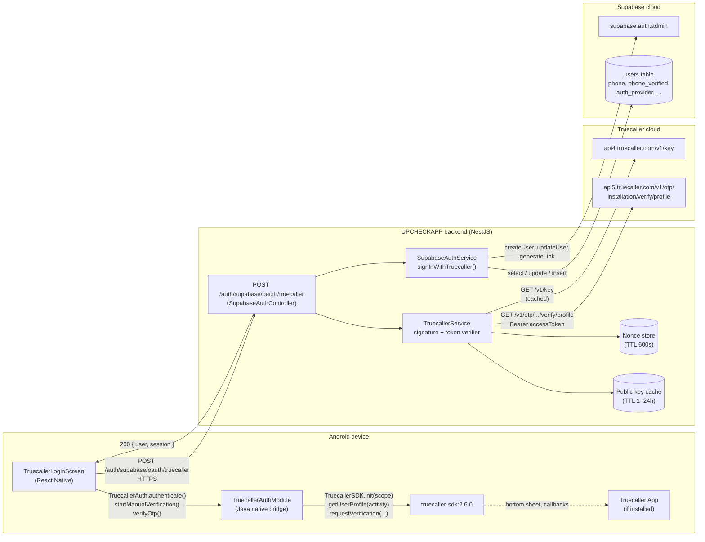
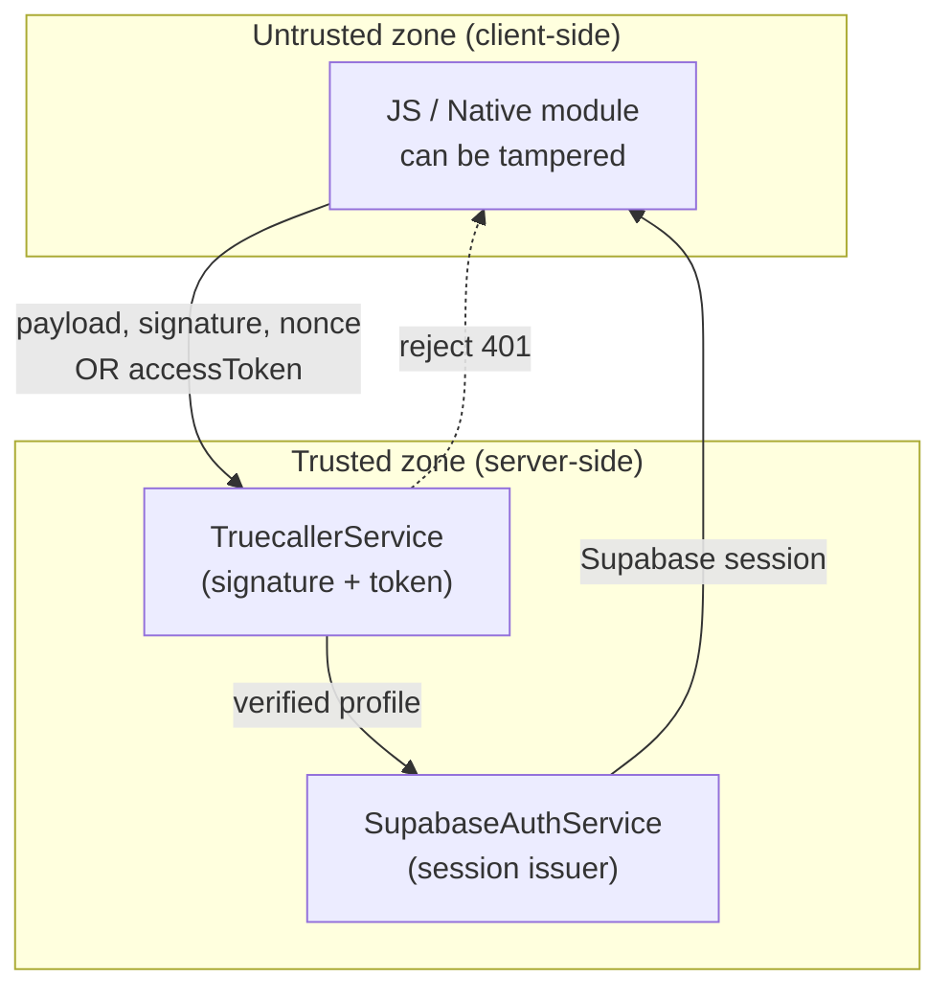
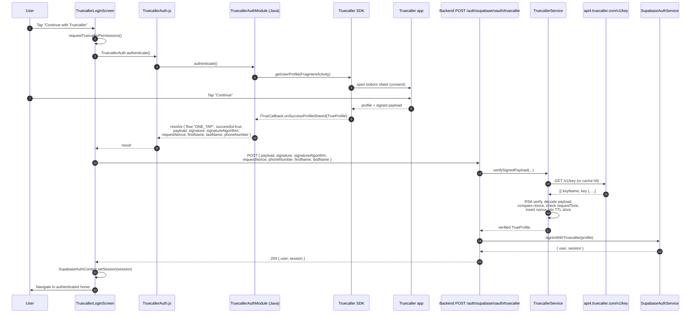
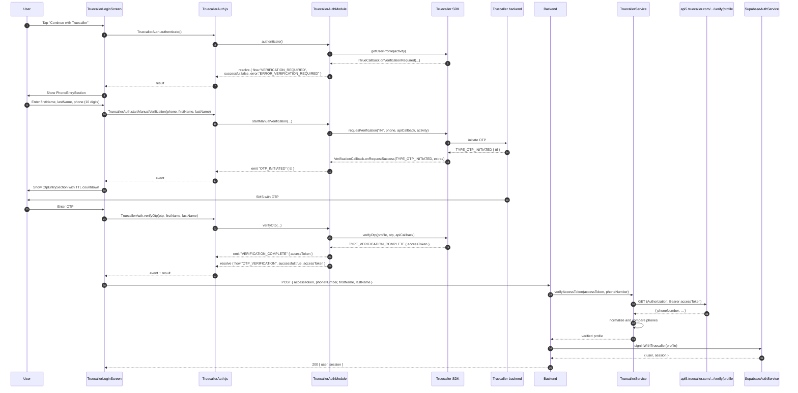
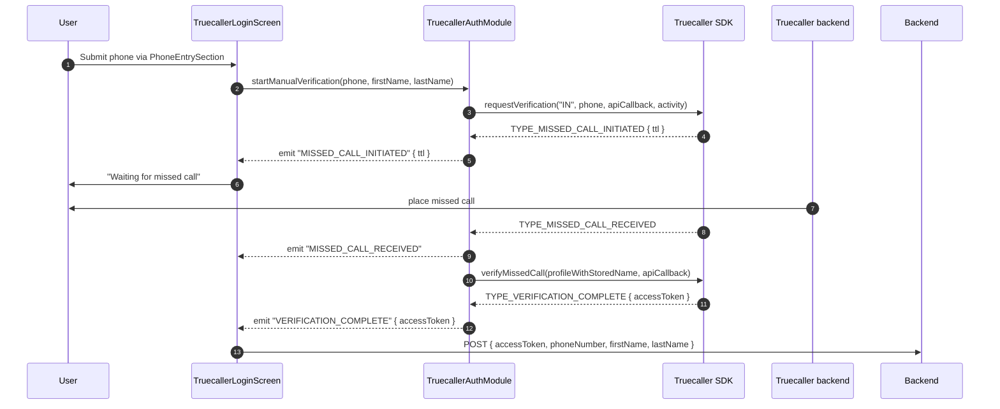
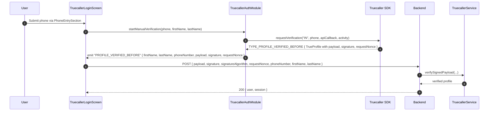
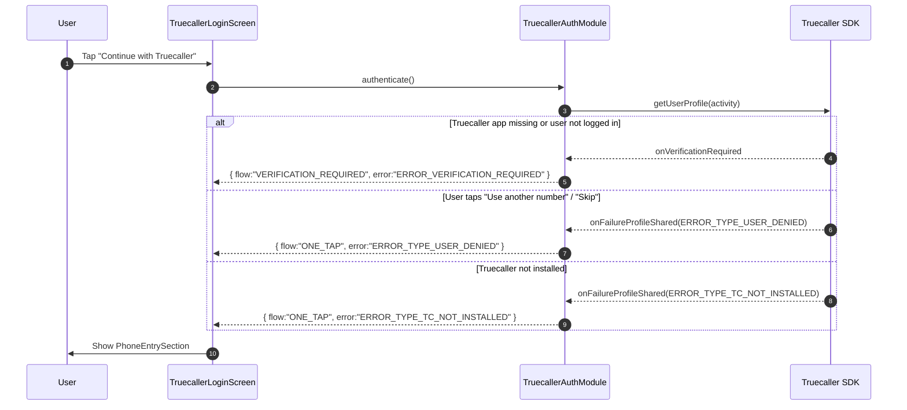
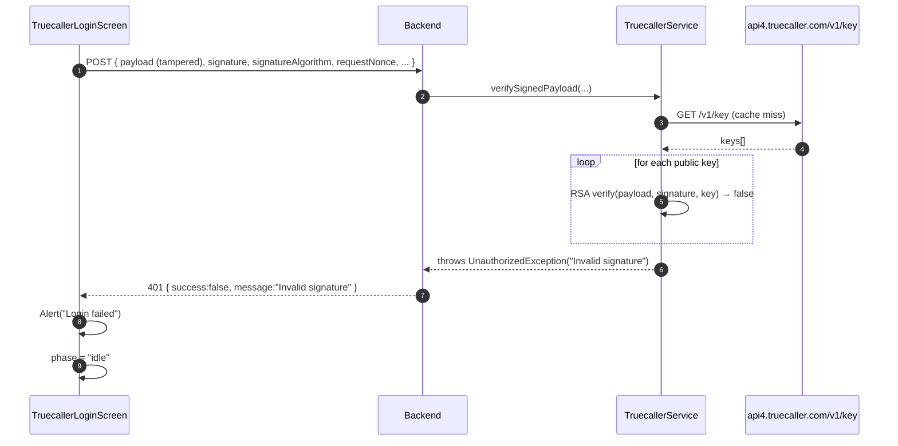
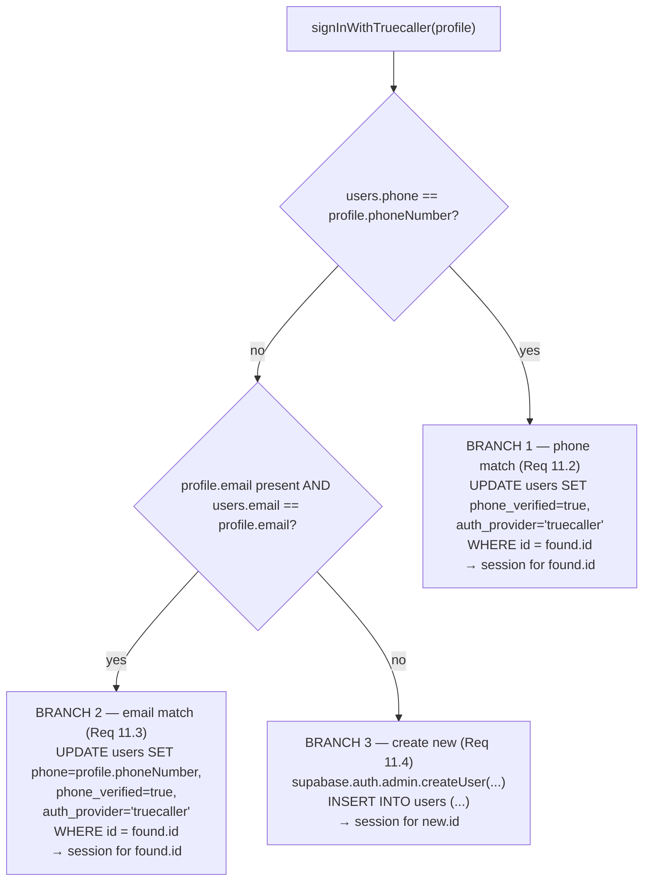

# Design Document

## Overview

This document specifies the design for integrating **Truecaller SDK 2.6.0 (legacy v2.x with Partner Key)** into the Upcheck React Native app for the Indian market. It consolidates the implementation guide in `TruecallerAuth.md` (the source of truth) into a buildable plan that maps cleanly onto the existing UPCHECKAPP codebase: the NestJS backend in `backend/`, the Expo + React Native frontend in `frontend/`, and the Supabase auth layer in `backend/src/auth/`.

### The two flows, one SDK configuration

The SDK is initialized once with `sdkOptions = SDK_OPTION_WITH_OTP`, which **unifies** the two end-user paths under a single entry point on `TruecallerLoginScreen`:

- **Flow A — One-Tap (Truecaller user, app installed and logged in).** Tap "Continue with Truecaller" → bottom sheet shows the Truecaller profile → user taps "Continue" → the SDK delivers `TrueProfile` plus `payload`, `signature`, `signatureAlgorithm`, and `requestNonce` to the bridge in roughly two seconds. No SMS, no missed call, no wait.
- **Flow B — Manual / OTP fallback (no Truecaller app, or unverified account).** SDK invokes `onVerificationRequired` → JS shows `PhoneEntrySection` → user enters first name, last name, and a 10-digit `^[6-9]\d{9}$` Indian mobile number → bridge calls `requestVerification("IN", phoneNumber, callback, activity)` → Truecaller's backend selects **missed call**, **SMS OTP**, or **WhatsApp IM OTP** per request → `OtpEntrySection` collects the OTP (auto-filled when SMS Retriever is configured) → bridge calls `verifyOtp(...)` or `verifyMissedCall(...)` → `TYPE_VERIFICATION_COMPLETE` delivers an `accessToken` to the bridge.

Both flows funnel into a single backend endpoint, `POST /auth/supabase/oauth/truecaller`, which performs server-side verification and issues a Supabase session identical in shape to the sessions issued by `POST /auth/supabase/signin` and `POST /auth/supabase/oauth/google`.

### Security boundaries

The fundamental design constraint, lifted from `TruecallerAuth.md` Part 7, is that **the client-side success response is spoofable**. A malicious user can return a fake `successful: true` to the JS bridge. The only thing that proves the user is real is:

1. For Flow A: an RSA signature over the payload, verifiable against Truecaller's published public keys at `https://api4.truecaller.com/v1/key`.
2. For Flow B: an access token that the backend can exchange server-to-server with `https://api5.truecaller.com/v1/otp/installation/verify/profile`.

Therefore, the trust boundary sits **at the backend**, not at the client. The native module emits whatever it receives from the SDK to JS, JS forwards it to the backend, and the backend is the only component allowed to call `SupabaseAuthService.signInWithTruecaller(...)`. Any bypass of this boundary creates a critical security hole, which is why this design treats the backend verifier as the central component and routes both One-Tap and OTP traffic through it.

### Replay protection

Every successfully verified `requestNonce` is persisted in a TTL store (in-memory `Map` for development, Redis or equivalent for production) for at least 600 seconds. A second request bearing the same `requestNonce` is rejected with HTTP 401, regardless of signature validity. This closes the replay attack vector that signature verification alone does not address.

### What this design does NOT change

- Existing email/password and Google OAuth flows in `SupabaseAuthService` and `SupabaseAuthController` remain available unchanged.
- The Supabase `users` table schema is reused; only `phone`, `phone_verified`, and `auth_provider` columns are touched.
- Existing `SupabaseAuthContext` on the frontend remains the single source of truth for session state — Truecaller login plugs into it via the same mechanism Google OAuth uses.

## Architecture

### High-level component diagram



### Layered responsibility

| Layer | Component | Responsibility | Trust |
|---|---|---|---|
| Truecaller cloud | `api4.truecaller.com`, `api5.truecaller.com` | Sign payloads, issue access tokens, expose public keys, return verified profile | Trusted (signed) |
| Backend | `TruecallerService` | RSA verification, key cache, nonce replay store, access token exchange, phone normalization | Trust authority — the only place that decides "is this user real?" |
| Backend | `SupabaseAuthService.signInWithTruecaller` | Account lookup, account linking, session issuance via Supabase admin API | Trusted (server-only, service-role key) |
| Backend | `SupabaseAuthController.truecallerOAuth` | HTTP boundary, request validation, response shape | Trusted boundary |
| Native bridge | `TruecallerAuthModule` (Java) | Wrap SDK, marshal callbacks to JS Promises and `NativeEventEmitter` events, hold `userFirstName`/`userLastName` for missed-call auto-completion, register `ActivityEventListener` for `SHARE_PROFILE_REQUEST_CODE` | Untrusted (client-side, attacker-controlled) |
| JS wrapper | `TruecallerAuth.js` | Typed Promise/Event API for app code | Untrusted |
| JS UI | `TruecallerLoginScreen.tsx`, `PhoneEntrySection`, `OtpEntrySection` | Drive the flow, surface errors, store the resulting Supabase session via `SupabaseAuthContext` | Untrusted |

The "untrusted" tag does not mean "ignore" — it means the client-side must still implement input validation, error mapping, and UX polish, but the **authorization decision** never depends on a client-side claim. That decision lives in `TruecallerService.verifySignedPayload(...)` and `TruecallerService.verifyAccessToken(...)`.

### Process boundary trust model




## Sequence Diagrams

### Flow A — One-Tap success



### Flow B — OTP via SMS success



### Flow B — Missed-call success



### Flow B — Profile-verified-before (returning OTP user with signed payload)



### Verification-required fallback (One-Tap → manual entry)



### Signature-mismatch failure




## Components and Interfaces

This section enumerates every file added or edited by this feature, with the exact path, the exact class/function names, the responsibilities, the dependencies, and a code skeleton lifted (verbatim where the source guide is the source of truth) from `TruecallerAuth.md`. The Android `applicationId` is `com.upcheck.app` (verified in `frontend/android/app/build.gradle`), so the Java/Kotlin package is `com.upcheck.app`.

### Android — `TruecallerAuthModule.java`

- **Path:** `frontend/android/app/src/main/java/com/upcheck/app/TruecallerAuthModule.java`
- **Class:** `com.upcheck.app.TruecallerAuthModule extends com.facebook.react.bridge.ReactContextBaseJavaModule`
- **`getName()` returns:** `"TruecallerAuthModule"`
- **Responsibilities:**
  - Initialize `TruecallerSDK.init(scope)` exactly once in the constructor with `consentMode = CONSENT_MODE_BOTTOMSHEET`, `sdkOptions = SDK_OPTION_WITH_OTP`, `privacyPolicyUrl`, and `termsOfServiceUrl`.
  - Implement `ITrueCallback` for the One-Tap path. On `onSuccessProfileShared`, resolve the pending Promise with `flow="ONE_TAP", successful=true, payload, signature, signatureAlgorithm, requestNonce, firstName, lastName, phoneNumber, countryCode, email, isVerified`. On `onFailureProfileShared`, resolve with `successful=false`, mapped error code, and the original numeric code in `errorCode`. On `onVerificationRequired`, resolve with `flow="VERIFICATION_REQUIRED", successful=false, error="ERROR_VERIFICATION_REQUIRED"`.
  - Implement `VerificationCallback` for the OTP/missed-call path. Forward each `requestCode` (`TYPE_OTP_INITIATED`, `TYPE_OTP_RECEIVED`, `TYPE_MISSED_CALL_INITIATED`, `TYPE_MISSED_CALL_RECEIVED`, `TYPE_VERIFICATION_COMPLETE`, `TYPE_PROFILE_VERIFIED_BEFORE`) as a `TruecallerVerificationEvent` event via `RCTDeviceEventEmitter`. Auto-call `verifyMissedCall(profile, apiCallback)` on `TYPE_MISSED_CALL_RECEIVED` using the stored `userFirstName` / `userLastName`.
  - Expose `@ReactMethod` entry points: `isUsable(Promise)`, `authenticate(Promise)`, `startManualVerification(String, String, String, Promise)`, `verifyOtp(String, String, String, Promise)`, `clear()`.
  - Register an `ActivityEventListener` that forwards `onActivityResult(...)` calls with `requestCode == TruecallerSDK.SHARE_PROFILE_REQUEST_CODE` to `TruecallerSDK.getInstance().onActivityResultObtained((FragmentActivity) activity, requestCode, resultCode, intent)`.
  - Map every `TrueError` numeric code to the canonical string code listed in Requirement 12.1, falling back to `ERROR_UNKNOWN_<code>`.
  - Resolve with `successful=false, error="ERROR_NO_ACTIVITY"` when `getCurrentActivity()` returns null.
  - In release builds, do NOT log `payload`, `signature`, `requestNonce`, `accessToken`, or any complete `phoneNumber` (Requirement 13.1).
- **Dependencies:**
  - `com.truecaller.android.sdk:truecaller-sdk:2.6.0`
  - `androidx.fragment:fragment` (transitive via React Native's `ReactFragmentActivity`)
  - `com.facebook.react:react-android` (the React Native core)
- **Code skeleton (verbatim from `TruecallerAuth.md` Part 4.1, with package adjusted to `com.upcheck.app` and brand colour matching the Upcheck palette):**

```java
package com.upcheck.app;

import android.app.Activity;
import android.content.Intent;
import android.graphics.Color;
import android.util.Log;

import androidx.annotation.NonNull;
import androidx.annotation.Nullable;
import androidx.fragment.app.FragmentActivity;

import com.facebook.react.bridge.Arguments;
import com.facebook.react.bridge.BaseActivityEventListener;
import com.facebook.react.bridge.ActivityEventListener;
import com.facebook.react.bridge.Promise;
import com.facebook.react.bridge.ReactApplicationContext;
import com.facebook.react.bridge.ReactContextBaseJavaModule;
import com.facebook.react.bridge.ReactMethod;
import com.facebook.react.bridge.WritableMap;

import com.truecaller.android.sdk.ITrueCallback;
import com.truecaller.android.sdk.TrueError;
import com.truecaller.android.sdk.TrueException;
import com.truecaller.android.sdk.TrueProfile;
import com.truecaller.android.sdk.TruecallerSDK;
import com.truecaller.android.sdk.TruecallerSdkScope;
import com.truecaller.android.sdk.clients.VerificationCallback;
import com.truecaller.android.sdk.clients.VerificationDataBundle;

public class TruecallerAuthModule extends ReactContextBaseJavaModule {

    private static final String TAG = "TruecallerAuthModule";
    private Promise promise = null;

    // Holds user-entered first/last name during non-TC verification
    private String userFirstName = "";
    private String userLastName = "";

    // ──────────────────────────────────────────────────────────────────
    // 1) Callback for One-Tap flow (Truecaller users)
    // ──────────────────────────────────────────────────────────────────
    private final ITrueCallback sdkCallback = new ITrueCallback() {

        @Override
        public void onSuccessProfileShared(@NonNull TrueProfile trueProfile) {
            if (promise == null) return;
            WritableMap map = Arguments.createMap();
            map.putString("flow", "ONE_TAP");
            map.putBoolean("successful", true);
            map.putString("firstName", trueProfile.firstName);
            map.putString("lastName", trueProfile.lastName);
            map.putString("phoneNumber", trueProfile.phoneNumber);
            map.putString("countryCode", trueProfile.countryCode);
            map.putString("email", trueProfile.email);
            map.putBoolean("isVerified", trueProfile.isTrueName);

            // SECURITY-CRITICAL: send these to your backend for validation
            map.putString("payload", trueProfile.payload);
            map.putString("signature", trueProfile.signature);
            map.putString("signatureAlgorithm", trueProfile.signatureAlgorithm);
            map.putString("requestNonce", trueProfile.requestNonce);

            promise.resolve(map);
            promise = null;
        }

        @Override
        public void onFailureProfileShared(@NonNull TrueError trueError) {
            Log.d(TAG, "onFailureProfileShared: " + trueError.getErrorType());
            if (promise == null) return;
            WritableMap map = Arguments.createMap();
            map.putString("flow", "ONE_TAP");
            map.putBoolean("successful", false);
            map.putString("error", mapErrorCode(trueError.getErrorType()));
            map.putInt("errorCode", trueError.getErrorType());
            promise.resolve(map);
            promise = null;
        }

        @Override
        public void onVerificationRequired(TrueError trueError) {
            // JS side will call startManualVerification(phoneNumber, firstName, lastName)
            Log.d(TAG, "onVerificationRequired — non-TC user, JS should call startManualVerification");
            if (promise == null) return;
            WritableMap map = Arguments.createMap();
            map.putString("flow", "VERIFICATION_REQUIRED");
            map.putBoolean("successful", false);
            map.putString("error", "ERROR_VERIFICATION_REQUIRED");
            promise.resolve(map);
            promise = null;
        }
    };

    // ──────────────────────────────────────────────────────────────────
    // 2) Callback for Non-TC verification (OTP / Missed call)
    // ──────────────────────────────────────────────────────────────────
    private final VerificationCallback apiCallback = new VerificationCallback() {

        @Override
        public void onRequestSuccess(int requestCode, @Nullable VerificationDataBundle extras) {
            WritableMap map = Arguments.createMap();
            String ttl = (extras != null) ? extras.getString(VerificationDataBundle.KEY_TTL) : null;

            switch (requestCode) {
                case VerificationCallback.TYPE_MISSED_CALL_INITIATED:
                    map.putString("event", "MISSED_CALL_INITIATED");
                    map.putString("ttl", ttl);
                    sendEvent("TruecallerVerificationEvent", map);
                    break;

                case VerificationCallback.TYPE_MISSED_CALL_RECEIVED:
                    map.putString("event", "MISSED_CALL_RECEIVED");
                    sendEvent("TruecallerVerificationEvent", map);
                    completeMissedCallVerification();
                    break;

                case VerificationCallback.TYPE_OTP_INITIATED:
                    map.putString("event", "OTP_INITIATED");
                    map.putString("ttl", ttl);
                    sendEvent("TruecallerVerificationEvent", map);
                    break;

                case VerificationCallback.TYPE_OTP_RECEIVED:
                    String otp = (extras != null) ? extras.getString(VerificationDataBundle.KEY_OTP) : null;
                    map.putString("event", "OTP_RECEIVED");
                    map.putString("otp", otp);
                    sendEvent("TruecallerVerificationEvent", map);
                    break;

                case VerificationCallback.TYPE_VERIFICATION_COMPLETE:
                    map.putString("event", "VERIFICATION_COMPLETE");
                    if (extras != null) {
                        map.putString("accessToken", extras.getString(VerificationDataBundle.KEY_ACCESS_TOKEN));
                    }
                    sendEvent("TruecallerVerificationEvent", map);
                    if (promise != null) {
                        WritableMap result = Arguments.createMap();
                        result.putString("flow", "OTP_VERIFICATION");
                        result.putBoolean("successful", true);
                        if (extras != null) {
                            result.putString("accessToken", extras.getString(VerificationDataBundle.KEY_ACCESS_TOKEN));
                        }
                        promise.resolve(result);
                        promise = null;
                    }
                    break;

                case VerificationCallback.TYPE_PROFILE_VERIFIED_BEFORE:
                    map.putString("event", "PROFILE_VERIFIED_BEFORE");
                    if (extras != null) {
                        TrueProfile p = extras.getProfile();
                        if (p != null) {
                            map.putString("firstName", p.firstName);
                            map.putString("lastName", p.lastName);
                            map.putString("phoneNumber", p.phoneNumber);
                            map.putString("payload", p.payload);
                            map.putString("signature", p.signature);
                            map.putString("requestNonce", p.requestNonce);
                        }
                    }
                    sendEvent("TruecallerVerificationEvent", map);
                    break;
            }
        }

        @Override
        public void onRequestFailure(int requestCode, @NonNull TrueException e) {
            Log.e(TAG, "Verification failure: " + e.getExceptionMessage());
            WritableMap map = Arguments.createMap();
            map.putString("event", "VERIFICATION_FAILED");
            map.putInt("exceptionCode", e.getExceptionType());
            map.putString("exceptionMessage", e.getExceptionMessage());
            sendEvent("TruecallerVerificationEvent", map);
            if (promise != null) {
                promise.resolve(map);
                promise = null;
            }
        }
    };

    // ──────────────────────────────────────────────────────────────────
    // Constructor — initialize the SDK once
    // ──────────────────────────────────────────────────────────────────
    public TruecallerAuthModule(ReactApplicationContext reactContext) {
        super(reactContext);

        TruecallerSdkScope trueScope = new TruecallerSdkScope.Builder(reactContext, sdkCallback)
                .consentMode(TruecallerSdkScope.CONSENT_MODE_BOTTOMSHEET)
                .buttonColor(Color.parseColor("#1E88E5"))
                .buttonTextColor(Color.parseColor("#FFFFFF"))
                .loginTextPrefix(TruecallerSdkScope.LOGIN_TEXT_PREFIX_TO_GET_STARTED)
                .loginTextSuffix(TruecallerSdkScope.LOGIN_TEXT_SUFFIX_PLEASE_VERIFY_MOBILE_NO)
                .ctaTextPrefix(TruecallerSdkScope.CTA_TEXT_PREFIX_USE)
                .buttonShapeOptions(TruecallerSdkScope.BUTTON_SHAPE_ROUNDED)
                .privacyPolicyUrl("https://upcheck.app/privacy")
                .termsOfServiceUrl("https://upcheck.app/terms")
                .footerType(TruecallerSdkScope.FOOTER_TYPE_SKIP)
                .consentTitleOption(TruecallerSdkScope.SDK_CONSENT_TITLE_LOG_IN)
                .sdkOptions(TruecallerSdkScope.SDK_OPTION_WITH_OTP)
                .build();

        TruecallerSDK.init(trueScope);
        reactContext.addActivityEventListener(mActivityEventListener);
    }

    @NonNull
    @Override
    public String getName() {
        return "TruecallerAuthModule";
    }

    // ──────────────────────────────────────────────────────────────────
    // JS-facing methods
    // ──────────────────────────────────────────────────────────────────

    @ReactMethod
    public void isUsable(Promise promise) {
        try {
            boolean usable = TruecallerSDK.getInstance() != null
                          && TruecallerSDK.getInstance().isUsable();
            promise.resolve(usable);
        } catch (Exception e) {
            promise.reject("E_ISUSABLE", e);
        }
    }

    @ReactMethod
    public void authenticate(Promise promise) {
        try {
            this.promise = promise;
            Activity activity = getCurrentActivity();
            if (activity == null) {
                rejectAndClear("ERROR_NO_ACTIVITY");
                return;
            }
            if (TruecallerSDK.getInstance() == null) {
                rejectAndClear("ERROR_SDK_NOT_INITIALIZED");
                return;
            }
            TruecallerSDK.getInstance().getUserProfile((FragmentActivity) activity);
        } catch (Exception e) {
            if (this.promise != null) this.promise.reject(e);
            this.promise = null;
        }
    }

    @ReactMethod
    public void startManualVerification(String phoneNumber, String firstName, String lastName, Promise promise) {
        try {
            this.promise = promise;
            this.userFirstName = firstName != null ? firstName : "";
            this.userLastName  = lastName  != null ? lastName  : "";

            Activity activity = getCurrentActivity();
            if (activity == null) {
                rejectAndClear("ERROR_NO_ACTIVITY");
                return;
            }
            TruecallerSDK.getInstance().requestVerification(
                    "IN",
                    phoneNumber,
                    apiCallback,
                    (FragmentActivity) activity
            );
        } catch (Exception e) {
            if (this.promise != null) this.promise.reject(e);
            this.promise = null;
        }
    }

    @ReactMethod
    public void verifyOtp(String otp, String firstName, String lastName, Promise promise) {
        try {
            this.promise = promise;
            TrueProfile profile = new TrueProfile.Builder(firstName, lastName).build();
            TruecallerSDK.getInstance().verifyOtp(profile, otp, apiCallback);
        } catch (Exception e) {
            promise.reject("E_VERIFY_OTP", e);
        }
    }

    @ReactMethod
    public void clear() {
        TruecallerSDK.clear();
    }

    // ──────────────────────────────────────────────────────────────────
    // Helpers
    // ──────────────────────────────────────────────────────────────────

    private void completeMissedCallVerification() {
        TrueProfile profile = new TrueProfile.Builder(userFirstName, userLastName).build();
        TruecallerSDK.getInstance().verifyMissedCall(profile, apiCallback);
    }

    private void sendEvent(String eventName, WritableMap params) {
        getReactApplicationContext()
                .getJSModule(com.facebook.react.modules.core.DeviceEventManagerModule.RCTDeviceEventEmitter.class)
                .emit(eventName, params);
    }

    private void rejectAndClear(String errorCode) {
        if (promise != null) {
            WritableMap map = Arguments.createMap();
            map.putBoolean("successful", false);
            map.putString("error", errorCode);
            promise.resolve(map);
            promise = null;
        }
    }

    private String mapErrorCode(int code) {
        switch (code) {
            case TrueError.ERROR_TYPE_INTERNAL:                       return "ERROR_TYPE_INTERNAL";
            case TrueError.ERROR_TYPE_NETWORK:                        return "ERROR_TYPE_NETWORK";
            case TrueError.ERROR_TYPE_USER_DENIED:                    return "ERROR_TYPE_USER_DENIED";
            case TrueError.ERROR_PROFILE_NOT_FOUND:                   return "ERROR_PROFILE_NOT_FOUND";
            case TrueError.ERROR_TYPE_UNAUTHORIZED_USER:              return "ERROR_TYPE_UNAUTHORIZED_USER";
            case TrueError.ERROR_TYPE_TRUECALLER_CLOSED_UNEXPECTEDLY: return "ERROR_TYPE_TRUECALLER_CLOSED_UNEXPECTEDLY";
            case TrueError.ERROR_TYPE_TRUESDK_TOO_OLD:                return "ERROR_TYPE_TRUESDK_TOO_OLD";
            case TrueError.ERROR_TYPE_POSSIBLE_REQ_CODE_COLLISION:    return "ERROR_TYPE_POSSIBLE_REQ_CODE_COLLISION";
            case TrueError.ERROR_TYPE_RESPONSE_SIGNATURE_MISMATCH:    return "ERROR_TYPE_RESPONSE_SIGNATURE_MISMATCH";
            case TrueError.ERROR_TYPE_REQUEST_NONCE_MISMATCH:         return "ERROR_TYPE_REQUEST_NONCE_MISMATCH";
            case TrueError.ERROR_TYPE_INVALID_ACCOUNT_STATE:          return "ERROR_TYPE_INVALID_ACCOUNT_STATE";
            case TrueError.ERROR_TYPE_TC_NOT_INSTALLED:               return "ERROR_TYPE_TC_NOT_INSTALLED";
            case TrueError.ERROR_TYPE_ACTIVITY_NOT_FOUND:             return "ERROR_TYPE_ACTIVITY_NOT_FOUND";
            default:                                                  return "ERROR_UNKNOWN_" + code;
        }
    }

    private final ActivityEventListener mActivityEventListener = new BaseActivityEventListener() {
        @Override
        public void onActivityResult(Activity activity, int requestCode, int resultCode, Intent intent) {
            super.onActivityResult(activity, requestCode, resultCode, intent);
            if (requestCode == TruecallerSDK.SHARE_PROFILE_REQUEST_CODE) {
                TruecallerSDK.getInstance().onActivityResultObtained(
                        (FragmentActivity) activity, requestCode, resultCode, intent);
            }
        }
    };
}
```

### Android — `TruecallerAuthPackage.java`

- **Path:** `frontend/android/app/src/main/java/com/upcheck/app/TruecallerAuthPackage.java`
- **Class:** `com.upcheck.app.TruecallerAuthPackage implements com.facebook.react.ReactPackage`
- **Responsibilities:** Return a single `TruecallerAuthModule` from `createNativeModules`, and an empty list from `createViewManagers`.
- **Dependencies:** `com.facebook.react:react-android`.
- **Code skeleton (verbatim from `TruecallerAuth.md` Part 4.2, package adjusted):**

```java
package com.upcheck.app;

import com.facebook.react.ReactPackage;
import com.facebook.react.bridge.NativeModule;
import com.facebook.react.bridge.ReactApplicationContext;
import com.facebook.react.uimanager.ViewManager;

import java.util.ArrayList;
import java.util.Collections;
import java.util.List;

public class TruecallerAuthPackage implements ReactPackage {
    @Override
    public List<ViewManager> createViewManagers(ReactApplicationContext reactContext) {
        return Collections.emptyList();
    }

    @Override
    public List<NativeModule> createNativeModules(ReactApplicationContext reactContext) {
        List<NativeModule> modules = new ArrayList<>();
        modules.add(new TruecallerAuthModule(reactContext));
        return modules;
    }
}
```

### Android — `MainApplication.kt` edit

- **Path:** `frontend/android/app/src/main/java/com/upcheck/app/MainApplication.kt`
- **Edit:** Inside `getPackages()`, append `TruecallerAuthPackage()` to the list returned by `PackageList(this).packages`.
- **Skeleton (Kotlin, matching the existing project's Kotlin `MainApplication`):**

```kotlin
override fun getPackages(): List<ReactPackage> =
    PackageList(this).packages.apply {
        add(TruecallerAuthPackage())
    }
```

### Android — `MainActivity.kt` (no functional change)

- **Path:** `frontend/android/app/src/main/java/com/upcheck/app/MainActivity.kt`
- **Required state:** Must extend `ReactActivity` (which extends `ReactFragmentActivity`, which extends `androidx.fragment.app.FragmentActivity`). Verified: the existing file already declares `class MainActivity : ReactActivity()`. **No changes needed.** The design's Requirement 3.6 is satisfied as long as nobody refactors `MainActivity` to extend `Activity` directly.

### Android — `AndroidManifest.xml` additions

- **Path:** `frontend/android/app/src/main/AndroidManifest.xml`
- **Edit:** Add the four (or six) `<uses-permission>` declarations and the `<meta-data>` Partner Key reference. Replace the existing `com.truecaller.android.sdk.ClientId` meta-data (which is for the OAuth 3.0 SDK that React Native does NOT use) with `com.truecaller.android.sdk.PartnerKey`.

```xml
<!-- existing permissions retained -->
<uses-permission android:name="android.permission.INTERNET"/>
<uses-permission android:name="android.permission.READ_EXTERNAL_STORAGE"/>
<uses-permission android:name="android.permission.RECORD_AUDIO"/>
<uses-permission android:name="android.permission.SYSTEM_ALERT_WINDOW"/>
<uses-permission android:name="android.permission.VIBRATE"/>
<uses-permission android:name="android.permission.WRITE_EXTERNAL_STORAGE"/>

<!-- ADDED for Truecaller OTP fallback flow -->
<uses-permission android:name="android.permission.READ_PHONE_STATE"/>
<uses-permission android:name="android.permission.READ_CALL_LOG"/>
<uses-permission android:name="android.permission.ANSWER_PHONE_CALLS"/>
<uses-permission android:name="android.permission.CALL_PHONE"/>

<!-- OPTIONAL: enable only if SMS Retriever auto-OTP is used (Part 9) -->
<!-- <uses-permission android:name="android.permission.RECEIVE_SMS"/> -->

<application ...>
    <!-- REPLACE the existing ClientId meta-data with the PartnerKey reference -->
    <meta-data
        android:name="com.truecaller.android.sdk.PartnerKey"
        android:value="@string/partnerKey" />
    ...
</application>
```

The existing `<activity android:name=".MainActivity" android:launchMode="singleTask" ... />` already satisfies the `singleTask` requirement that prevents duplicate activity instances from breaking Truecaller's deep-link callbacks.

### Android — `android/app/build.gradle` additions

- **Path:** `frontend/android/app/build.gradle`
- **Edit:** Replace the placeholder `implementation project(':react-native-truecaller-sdk')` line (which references a non-existent autolinked library) with the real SDK dependency. Confirm `minSdkVersion >= 21` (already true through `rootProject.ext.minSdkVersion`).

```gradle
dependencies {
    implementation("com.facebook.react:react-android")

    // Truecaller SDK 2.6.0 (legacy v2.x with PartnerKey, NOT OAuth 3.0)
    implementation("com.truecaller.android.sdk:truecaller-sdk:2.6.0")

    // ... rest unchanged
}
```

If a duplicate-class error appears for `okhttp3.*`, exclude the transitive dep:

```gradle
implementation("com.truecaller.android.sdk:truecaller-sdk:2.6.0") {
    exclude group: 'com.squareup.okhttp3'
}
```

### Android — `android/build.gradle` (project-level repo)

- **Path:** `frontend/android/build.gradle`
- **Edit:** Ensure `mavenCentral()` is in `allprojects.repositories` so Gradle can resolve `com.truecaller.android.sdk:truecaller-sdk:2.6.0`.

```gradle
allprojects {
    repositories {
        google()
        mavenCentral()  // required for Truecaller SDK
    }
}
```

### Android — `strings.xml` and `partner-keys.xml`

- **Path:** `frontend/android/app/src/main/res/values/strings.xml`
- **Edit (committed file, no secret value):** No `partnerKey` entry here. Keep the file safe to commit.
- **Path:** `frontend/android/app/src/main/res/values/partner-keys.xml` (gitignored)
- **Edit (uncommitted):**

```xml
<?xml version="1.0" encoding="utf-8"?>
<resources>
    <string name="partnerKey">PASTE_REAL_PARTNER_KEY_HERE</string>
</resources>
```

- **Path:** `frontend/.gitignore` (or root `.gitignore`)
- **Edit:** Add the line `frontend/android/app/src/main/res/values/partner-keys.xml`.
- **Rationale:** Android's resource merger merges every XML file under `res/values/` into the same `R.string` namespace, so `R.string.partnerKey` resolves at build time. Splitting the secret into a gitignored file keeps the public repo clean while keeping the manifest reference `@string/partnerKey` working.

**Failure mode (Requirement 2.4):** If `partner-keys.xml` is missing at build time, the manifest resource link will fail at compile time (`AAPT: error: resource string/partnerKey not found`). At runtime, if a stub file with an empty string is committed by mistake, `TruecallerSDK.init` raises an `IllegalArgumentException` that is caught in the module constructor; subsequent `isUsable()` calls return `false` and `authenticate()` rejects with `ERROR_SDK_NOT_INITIALIZED`.

### Android — ProGuard keep rules

- **Path:** `frontend/android/app/proguard-rules.pro`
- **Edit:** Append the following at the bottom of the file. Without these rules R8/ProGuard strips the SDK's reflection-loaded classes and release-build verification fails with `ClassNotFoundException`.

```proguard
# Truecaller SDK keep rules (Part 8 of TruecallerAuth.md, also Part 11 issue #5)
-keep class com.truecaller.android.sdk.** { *; }
-keep interface com.truecaller.android.sdk.** { *; }
```

### JS — `src/native/TruecallerAuth.js`

- **Path:** `frontend/src/native/TruecallerAuth.js`
- **Exports:** `TruecallerAuth` (object with five Promise-returning methods) and `TruecallerEvents` (object with `onEvent(callback)`).
- **Code (verbatim from `TruecallerAuth.md` Part 5.2):**

```javascript
import { NativeModules, NativeEventEmitter } from 'react-native';

const { TruecallerAuthModule } = NativeModules;
const eventEmitter = new NativeEventEmitter(TruecallerAuthModule);

export const TruecallerEvents = {
  onEvent: (cb) => eventEmitter.addListener('TruecallerVerificationEvent', cb),
};

export const TruecallerAuth = {
  isUsable: () => TruecallerAuthModule.isUsable(),
  authenticate: () => TruecallerAuthModule.authenticate(),
  startManualVerification: (phoneNumber, firstName, lastName) =>
    TruecallerAuthModule.startManualVerification(phoneNumber, firstName, lastName),
  verifyOtp: (otp, firstName, lastName) =>
    TruecallerAuthModule.verifyOtp(otp, firstName, lastName),
  clear: () => TruecallerAuthModule.clear(),
};
```

### JS — `src/native/permissions.js`

- **Path:** `frontend/src/native/permissions.js`
- **Export:** `requestTruecallerPermissions()` returning a `Promise<boolean>`.
- **Code (verbatim from `TruecallerAuth.md` Part 5.1):**

```javascript
import { PermissionsAndroid, Platform } from 'react-native';

export async function requestTruecallerPermissions() {
  if (Platform.OS !== 'android') return false;

  const apiLevel = Platform.Version;
  const perms = [
    PermissionsAndroid.PERMISSIONS.READ_PHONE_STATE,
    PermissionsAndroid.PERMISSIONS.READ_CALL_LOG,
  ];

  if (apiLevel >= 26) {
    perms.push(PermissionsAndroid.PERMISSIONS.ANSWER_PHONE_CALLS);
  } else {
    perms.push(PermissionsAndroid.PERMISSIONS.CALL_PHONE);
  }

  const result = await PermissionsAndroid.requestMultiple(perms);
  return Object.values(result).every(s => s === PermissionsAndroid.RESULTS.GRANTED);
}
```

### JS — `src/screens/TruecallerLoginScreen.tsx`

- **Path:** `frontend/src/screens/TruecallerLoginScreen.tsx`
- **Component:** `TruecallerLoginScreen({ onLoggedIn })` — owns the FSM state `phase ∈ { 'idle', 'manual', 'awaiting_otp', 'awaiting_missed_call', 'verifying' }`.
- **Responsibilities:**
  - Call `requestTruecallerPermissions()` before invoking `TruecallerAuth.authenticate()` (Requirement 3.4).
  - Subscribe to `TruecallerEvents.onEvent(...)` once on mount, unsubscribe on unmount via `sub.remove()` (Requirement 5.2).
  - Implement the routing table from Requirement 6.4 / 12.2 / 12.3 (which errors lead to PhoneEntrySection, which to a network error message, which to an exception alert).
  - POST to `${BACKEND_URL}/auth/supabase/oauth/truecaller` with the appropriate request body shape (see Data Models).
  - On 200, store the returned Supabase session via `useSupabaseAuth().setSession(session)` from the existing `SupabaseAuthContext`, then navigate to the authenticated home route.
  - Render a "Sign in with email" link visible from every phase (Requirement 12.5).
- **Skeleton (adapted from `TruecallerAuth.md` Part 5.3, refactored to TypeScript and split into the three sections required):**

```tsx
import React, { useState, useEffect } from 'react';
import { View, Text, Alert, Pressable } from 'react-native';
import { TruecallerAuth, TruecallerEvents } from '../native/TruecallerAuth';
import { requestTruecallerPermissions } from '../native/permissions';
import { useSupabaseAuth } from '../context/SupabaseAuthContext';
import { PhoneEntrySection } from '../components/auth/PhoneEntrySection';
import { OtpEntrySection } from '../components/auth/OtpEntrySection';

type Phase = 'idle' | 'manual' | 'awaiting_otp' | 'awaiting_missed_call' | 'verifying';

export default function TruecallerLoginScreen({ navigation }: any) {
  const { setSession } = useSupabaseAuth();
  const [phase, setPhase] = useState<Phase>('idle');
  const [phone, setPhone] = useState('');
  const [firstName, setFirstName] = useState('');
  const [lastName, setLastName] = useState('');
  const [otp, setOtp] = useState('');
  const [ttl, setTtl] = useState<number | null>(null);

  useEffect(() => {
    const sub = TruecallerEvents.onEvent((e) => {
      switch (e.event) {
        case 'OTP_INITIATED':
          setPhase('awaiting_otp');
          setTtl(parseInt(e.ttl, 10));
          break;
        case 'OTP_RECEIVED':
          if (e.otp) setOtp(e.otp);
          break;
        case 'MISSED_CALL_INITIATED':
          setPhase('awaiting_missed_call');
          setTtl(parseInt(e.ttl, 10));
          break;
        case 'MISSED_CALL_RECEIVED':
          setPhase('verifying');
          break;
        case 'VERIFICATION_COMPLETE':
          sendToBackend({
            accessToken: e.accessToken,
            phoneNumber: '+91' + phone,
            firstName, lastName,
          });
          break;
        case 'PROFILE_VERIFIED_BEFORE':
          sendToBackend({
            payload: e.payload,
            signature: e.signature,
            signatureAlgorithm: 'SHA512withRSA',
            requestNonce: e.requestNonce,
            phoneNumber: e.phoneNumber,
            firstName: e.firstName,
            lastName: e.lastName,
          });
          break;
        case 'VERIFICATION_FAILED':
          Alert.alert('Verification failed', e.exceptionMessage);
          setPhase('manual');
          break;
      }
    });
    return () => sub.remove();
  }, [phone, firstName, lastName]);

  const handleStartAuth = async () => {
    const ok = await requestTruecallerPermissions();
    if (!ok) {
      Alert.alert('Permissions needed', 'Please grant phone permissions to continue.');
      return;
    }

    const result = await TruecallerAuth.authenticate();

    if (result.flow === 'ONE_TAP' && result.successful) {
      sendToBackend({
        payload: result.payload,
        signature: result.signature,
        signatureAlgorithm: result.signatureAlgorithm,
        requestNonce: result.requestNonce,
        phoneNumber: result.phoneNumber,
        firstName: result.firstName,
        lastName: result.lastName,
      });
      return;
    }

    // Error routing (Requirement 12)
    switch (result.error) {
      case 'ERROR_VERIFICATION_REQUIRED':
      case 'ERROR_TYPE_TC_NOT_INSTALLED':
      case 'ERROR_TYPE_USER_DENIED':
      case 'ERROR_PROFILE_NOT_FOUND':
      case 'ERROR_TYPE_UNAUTHORIZED_USER':
      case 'ERROR_TYPE_TRUESDK_TOO_OLD':
      case 'ERROR_TYPE_INVALID_ACCOUNT_STATE':
        setPhase('manual');
        break;
      case 'ERROR_TYPE_NETWORK':
        Alert.alert(
          'No internet connection',
          'Please check your network and try again',
        );
        setPhase('idle');
        break;
      default:
        Alert.alert('Login failed', result.error || 'Unknown error');
        setPhase('idle');
    }
  };

  const sendToBackend = async (data: any) => {
    setPhase('verifying');
    try {
      const res = await fetch(`${process.env.EXPO_PUBLIC_BACKEND_URL}/auth/supabase/oauth/truecaller`, {
        method: 'POST',
        headers: { 'Content-Type': 'application/json' },
        body: JSON.stringify(data),
      });
      if (!res.ok) {
        const json = await res.json().catch(() => ({}));
        Alert.alert('Auth failed', json.message || `HTTP ${res.status}`);
        setPhase('idle');
        return;
      }
      const { user, session } = await res.json();
      await setSession(session);
      navigation.replace('AuthenticatedHome');
    } catch (err: any) {
      Alert.alert('Network error', err?.message ?? 'Unknown');
      setPhase('idle');
    }
  };

  return (
    <View style={{ flex: 1, padding: 20 }}>
      {phase === 'idle' && (
        <Pressable onPress={handleStartAuth}>
          <Text>Continue with Truecaller</Text>
        </Pressable>
      )}
      {phase === 'manual' && (
        <PhoneEntrySection
          firstName={firstName} setFirstName={setFirstName}
          lastName={lastName} setLastName={setLastName}
          phone={phone} setPhone={setPhone}
          onSubmit={() => TruecallerAuth.startManualVerification(phone, firstName, lastName)}
        />
      )}
      {phase === 'awaiting_otp' && (
        <OtpEntrySection
          otp={otp} setOtp={setOtp} ttl={ttl} phone={phone}
          onVerify={() => TruecallerAuth.verifyOtp(otp, firstName, lastName)}
        />
      )}
      {phase === 'awaiting_missed_call' && (
        <Text>You'll receive a missed call shortly. Don't pick up — we'll auto-verify ({ttl}s)</Text>
      )}
      {phase === 'verifying' && <Text>Verifying...</Text>}

      <Pressable onPress={() => navigation.replace('EmailLogin')}>
        <Text>Sign in with email</Text>
      </Pressable>
    </View>
  );
}
```

### JS — `src/components/auth/PhoneEntrySection.tsx`

- **Path:** `frontend/src/components/auth/PhoneEntrySection.tsx`
- **Component props:** `firstName, setFirstName, lastName, setLastName, phone, setPhone, onSubmit` (all string state pairs except onSubmit).
- **Responsibilities (Requirement 7):** Validate first name (1–50 chars), last name (0–50 chars), and `^[6-9]\d{9}$`. On invalid input, show the corresponding error message and DO NOT call `onSubmit`.

```tsx
import React, { useState } from 'react';
import { View, Text, TextInput, Pressable } from 'react-native';

export function PhoneEntrySection({
  firstName, setFirstName, lastName, setLastName, phone, setPhone, onSubmit,
}: any) {
  const [error, setError] = useState<string | null>(null);

  const submit = () => {
    if (!firstName.trim()) {
      setError('Please enter your first name');
      return;
    }
    if (firstName.length > 50 || lastName.length > 50) {
      setError('Names must be 50 characters or fewer');
      return;
    }
    if (!/^[6-9]\d{9}$/.test(phone)) {
      setError('Enter a valid 10-digit Indian mobile number');
      return;
    }
    setError(null);
    onSubmit();
  };

  return (
    <View>
      <TextInput placeholder="First name" value={firstName} onChangeText={setFirstName} maxLength={50} />
      <TextInput placeholder="Last name (optional)" value={lastName} onChangeText={setLastName} maxLength={50} />
      <TextInput
        placeholder="Phone (10 digits)"
        value={phone} onChangeText={setPhone}
        keyboardType="phone-pad" maxLength={10}
      />
      {error && <Text style={{ color: 'red' }}>{error}</Text>}
      <Pressable onPress={submit}><Text>Send OTP</Text></Pressable>
    </View>
  );
}
```

### JS — `src/components/auth/OtpEntrySection.tsx`

- **Path:** `frontend/src/components/auth/OtpEntrySection.tsx`
- **Component props:** `otp, setOtp, ttl, phone, onVerify`.
- **Responsibilities (Requirement 8):** Render TTL countdown, disable resend until TTL = 0, validate OTP length ≥ 4 before calling `onVerify`.

```tsx
import React, { useEffect, useState } from 'react';
import { View, Text, TextInput, Pressable } from 'react-native';

export function OtpEntrySection({ otp, setOtp, ttl, phone, onVerify }: any) {
  const [remaining, setRemaining] = useState<number>(ttl ?? 0);
  const [error, setError] = useState<string | null>(null);

  useEffect(() => {
    setRemaining(ttl ?? 0);
    const id = setInterval(() => setRemaining((r) => Math.max(0, r - 1)), 1000);
    return () => clearInterval(id);
  }, [ttl]);

  const verify = () => {
    if (!otp || otp.length < 4) {
      setError('Invalid OTP');
      return;
    }
    setError(null);
    onVerify();
  };

  return (
    <View>
      <Text>Enter the OTP sent to +91{phone} (expires in {remaining}s)</Text>
      <TextInput
        placeholder="OTP" value={otp} onChangeText={setOtp}
        keyboardType="number-pad"
      />
      {error && <Text style={{ color: 'red' }}>{error}</Text>}
      <Pressable onPress={verify}><Text>Verify</Text></Pressable>
      <Pressable disabled={remaining > 0} onPress={() => { /* re-trigger startManualVerification upstream */ }}>
        <Text style={{ opacity: remaining > 0 ? 0.4 : 1 }}>Resend OTP</Text>
      </Pressable>
    </View>
  );
}
```

### JS — `SupabaseAuthContext` integration

- **Path:** `frontend/src/context/SupabaseAuthContext.tsx` (existing file)
- **Edit:** No interface change — `setSession(session)` already exists for the email/Google paths. `TruecallerLoginScreen` calls the same method with the session returned from the backend, which is shape-identical to a Supabase email/password sign-in response.
- **Logout integration (Requirement 14):** The existing logout button's handler must, in addition to its current Supabase signout, call `TruecallerAuth.clear()` so the next sign-in re-displays the bottom-sheet consent.

```ts
// inside the existing logout handler in SupabaseAuthContext (or wherever logout lives)
import { TruecallerAuth } from '../native/TruecallerAuth';

async function logout() {
  await supabase.auth.signOut();
  try {
    TruecallerAuth.clear();
  } catch {
    // best-effort: do not block logout if native module is unavailable
  }
  // ... existing cleanup
}
```

### Backend — `backend/src/auth/truecaller.service.ts`

- **Path:** `backend/src/auth/truecaller.service.ts`
- **Class:** `TruecallerService` (existing, to be extended).
- **New public methods:**
  - `verifySignedPayload(input: VerifySignedPayloadInput): Promise<VerifiedTruecallerProfile>` — implements Requirement 9.
  - `verifyAccessToken(accessToken: string, expectedPhoneNumber: string): Promise<VerifiedTruecallerProfile>` — implements Requirement 10. **This replaces the current stubbed `verifyAccessToken`** which only returned a boolean and trusted the SDK; the new implementation throws `UnauthorizedException` on every failure path described in Requirement 10.
- **New private helpers:**
  - `fetchPublicKeys(): Promise<TruecallerPublicKey[]>` — wraps `axios.get('https://api4.truecaller.com/v1/key')` with a 1–24h cache.
  - `markNonceUsed(nonce: string): Promise<void>` — inserts the nonce into a TTL store.
  - `assertNonceUnused(nonce: string): Promise<void>` — throws if the nonce is already in the TTL store.
  - `normalizePhone(phone: string): string` — strips a leading `+91` and any non-digit characters before equality comparison (Requirement 10.4).
  - `maskPhoneForLogs(phone: string): string` — returns `+91XXXXXX1234` (Requirement 13.3).
- **Dependencies:**
  - `axios` (already a dependency).
  - `crypto` from Node stdlib (`crypto.createVerify(algo).update(payload).verify(pem, signature, 'base64')`).
  - `@nestjs/config` for env vars (`TRUECALLER_KEY_URL`, `TRUECALLER_PROFILE_URL`, `TRUECALLER_KEY_CACHE_TTL_MS`, `TRUECALLER_NONCE_TTL_MS`).
  - `@nestjs/common` for `Injectable`, `UnauthorizedException`, `BadRequestException`, `Logger`.
- **Skeleton (consolidated from `TruecallerAuth.md` Part 7.2 and adapted to NestJS conventions):**

```typescript
import { Injectable, UnauthorizedException, Logger } from '@nestjs/common';
import { ConfigService } from '@nestjs/config';
import axios from 'axios';
import * as crypto from 'crypto';

interface TruecallerPublicKey { keyName: string; key: string; }
interface DecodedPayload {
  requestNonce: string;
  requestTime: number;
  verifier: string;
  phoneNumberHash?: string;
  firstName?: string;
  lastName?: string;
  phoneNumber?: string;
  email?: string;
  avatarUrl?: string;
  countryCode?: string;
  city?: string;
  // ... other Truecaller fields
}

export interface VerifySignedPayloadInput {
  payload: string;            // base64 JSON
  signature: string;           // base64 RSA signature
  signatureAlgorithm: string;  // "SHA512withRSA" | "SHA256withRSA"
  requestNonce: string;        // top-level nonce
}

export interface VerifiedTruecallerProfile {
  phoneNumber: string;
  firstName: string;
  lastName?: string;
  email?: string;
  avatarUrl?: string;
}

@Injectable()
export class TruecallerService {
  private readonly logger = new Logger(TruecallerService.name);
  private readonly keyUrl: string;
  private readonly profileUrl: string;
  private readonly keyCacheTtlMs: number;
  private readonly nonceTtlMs: number;

  // In-memory caches. For production, swap nonceStore for Redis (see Configuration & Secrets).
  private keyCache: { keys: TruecallerPublicKey[]; fetchedAt: number } | null = null;
  private nonceStore: Map<string, number> = new Map(); // nonce → expiresAt

  constructor(private configService: ConfigService) {
    this.keyUrl = this.configService.get('TRUECALLER_KEY_URL') || 'https://api4.truecaller.com/v1/key';
    this.profileUrl = this.configService.get('TRUECALLER_PROFILE_URL')
      || 'https://api5.truecaller.com/v1/otp/installation/verify/profile';
    this.keyCacheTtlMs = parseInt(
      this.configService.get('TRUECALLER_KEY_CACHE_TTL_MS') ?? `${60 * 60 * 1000}`,
      10,
    );
    this.nonceTtlMs = parseInt(
      this.configService.get('TRUECALLER_NONCE_TTL_MS') ?? `${10 * 60 * 1000}`,
      10,
    );
  }

  async verifySignedPayload(input: VerifySignedPayloadInput): Promise<VerifiedTruecallerProfile> {
    const { payload, signature, signatureAlgorithm, requestNonce } = input;

    // 1. Replay-protection upfront so a stolen nonce can't burn keys
    await this.assertNonceUnused(requestNonce);

    // 2. RSA verify against every cached key
    const keys = await this.fetchPublicKeys();
    const algo = signatureAlgorithm.includes('512') ? 'RSA-SHA512' : 'RSA-SHA256';

    const verified = keys.some(({ key }) => {
      const verifier = crypto.createVerify(algo);
      verifier.update(payload);
      const pem = `-----BEGIN PUBLIC KEY-----\n${key}\n-----END PUBLIC KEY-----`;
      try {
        return verifier.verify(pem, signature, 'base64');
      } catch {
        return false;
      }
    });

    if (!verified) {
      throw new UnauthorizedException({ success: false, message: 'Invalid signature' });
    }

    // 3. Decode payload and check nonce + freshness
    let decoded: DecodedPayload;
    try {
      decoded = JSON.parse(Buffer.from(payload, 'base64').toString('utf-8'));
    } catch {
      throw new UnauthorizedException({ success: false, message: 'Invalid payload' });
    }

    if (decoded.requestNonce !== requestNonce) {
      throw new UnauthorizedException({ success: false, message: 'Nonce mismatch' });
    }

    if (Date.now() - decoded.requestTime > 600_000) {
      throw new UnauthorizedException({ success: false, message: 'Payload expired' });
    }

    // 4. Persist nonce so a replay within the TTL window is rejected
    await this.markNonceUsed(requestNonce);

    return {
      phoneNumber: decoded.phoneNumber ?? '',
      firstName: decoded.firstName ?? 'User',
      lastName: decoded.lastName,
      email: decoded.email,
      avatarUrl: decoded.avatarUrl,
    };
  }

  async verifyAccessToken(accessToken: string, expectedPhoneNumber: string): Promise<VerifiedTruecallerProfile> {
    let res;
    try {
      res = await axios.get(this.profileUrl, {
        headers: { Authorization: `Bearer ${accessToken}` },
        validateStatus: () => true,
      });
    } catch {
      throw new UnauthorizedException({ success: false, message: 'Invalid access token' });
    }

    if (res.status < 200 || res.status >= 300) {
      throw new UnauthorizedException({ success: false, message: 'Invalid access token' });
    }

    const profile = res.data;
    if (!profile || !profile.phoneNumber) {
      throw new UnauthorizedException({ success: false, message: 'Invalid Truecaller profile' });
    }

    if (this.normalizePhone(profile.phoneNumber) !== this.normalizePhone(expectedPhoneNumber)) {
      throw new UnauthorizedException({ success: false, message: 'Phone number mismatch' });
    }

    return {
      phoneNumber: profile.phoneNumber,
      firstName: profile.firstName ?? 'User',
      lastName: profile.lastName,
      email: profile.email,
      avatarUrl: profile.avatarUrl,
    };
  }

  // ────────── helpers ──────────

  private async fetchPublicKeys(): Promise<TruecallerPublicKey[]> {
    const now = Date.now();
    if (this.keyCache && now - this.keyCache.fetchedAt < this.keyCacheTtlMs) {
      return this.keyCache.keys;
    }
    const res = await axios.get(this.keyUrl);
    const keys: TruecallerPublicKey[] = Array.isArray(res.data) ? res.data : (res.data?.keys ?? []);
    if (!keys.length) {
      throw new UnauthorizedException({ success: false, message: 'Public key fetch failed' });
    }
    this.keyCache = { keys, fetchedAt: now };
    return keys;
  }

  private async assertNonceUnused(nonce: string): Promise<void> {
    this.evictExpiredNonces();
    if (this.nonceStore.has(nonce)) {
      throw new UnauthorizedException({ success: false, message: 'Nonce already used' });
    }
  }

  private async markNonceUsed(nonce: string): Promise<void> {
    this.nonceStore.set(nonce, Date.now() + this.nonceTtlMs);
  }

  private evictExpiredNonces(): void {
    const now = Date.now();
    for (const [nonce, expiresAt] of this.nonceStore.entries()) {
      if (expiresAt <= now) this.nonceStore.delete(nonce);
    }
  }

  normalizePhone(phone: string): string {
    return (phone ?? '').replace(/^\+?91/, '').replace(/\D/g, '');
  }

  maskPhoneForLogs(phone: string): string {
    const digits = this.normalizePhone(phone);
    if (digits.length < 4) return '+91XXXXXXXXXX';
    return `+91XXXXXX${digits.slice(-4)}`;
  }
}
```

**Production swap:** the `nonceStore: Map<string, number>` and the `keyCache` are designed so they can be replaced with Redis without changing the public method signatures. The interfaces `assertNonceUnused`, `markNonceUsed`, and `fetchPublicKeys` remain the same; only the bodies change.

### Backend — `backend/src/auth/supabase-auth.controller.ts` route

- **Path:** `backend/src/auth/supabase-auth.controller.ts`
- **Edit:** Replace the body of `truecallerOAuth` so it:
  1. Discriminates between One-Tap (has `payload + signature`) and OTP (has `accessToken`) based on the request body.
  2. Calls `truecallerService.verifySignedPayload(...)` or `truecallerService.verifyAccessToken(...)`. **Both throw `UnauthorizedException` on failure** — the controller no longer needs the boolean check.
  3. Passes the **verified** profile (NOT the request body) to `supabaseAuthService.signInWithTruecaller(...)` (Requirement 11.1).
  4. Returns 200 with `{ message, user, session }` matching `POST /auth/supabase/signin`.
- **Skeleton:**

```typescript
@Public()
@Post('oauth/truecaller')
async truecallerOAuth(@Body() body: TruecallerAuthDto) {
  const {
    payload, signature, signatureAlgorithm, requestNonce,
    accessToken, phoneNumber, firstName, lastName,
  } = body;

  // Validate request shape
  if (!phoneNumber) {
    throw new UnauthorizedException({ success: false, message: 'Invalid request' });
  }

  let verifiedProfile: VerifiedTruecallerProfile;
  if (payload && signature && signatureAlgorithm && requestNonce) {
    verifiedProfile = await this.truecallerService.verifySignedPayload({
      payload, signature, signatureAlgorithm, requestNonce,
    });
  } else if (accessToken) {
    verifiedProfile = await this.truecallerService.verifyAccessToken(accessToken, phoneNumber);
  } else {
    throw new UnauthorizedException({ success: false, message: 'Invalid request' });
  }

  // Issue Supabase session with VERIFIED profile (Requirement 11.1)
  const result = await this.supabaseAuthService.signInWithTruecaller({
    phoneNumber: verifiedProfile.phoneNumber,
    firstName: verifiedProfile.firstName ?? firstName ?? 'User',
    lastName: verifiedProfile.lastName ?? lastName,
    email: verifiedProfile.email,
    avatarUrl: verifiedProfile.avatarUrl,
  });

  return {
    message: 'Truecaller authentication successful',
    user: result.user,
    session: result.session,
  };
}
```

### Backend — `backend/src/auth/supabase-auth.service.ts` `signInWithTruecaller`

- **Path:** `backend/src/auth/supabase-auth.service.ts`
- **Existing method:** `signInWithTruecaller(profile)` already implements the three branches. Confirm behaviour matches Requirement 11.2 / 11.3 / 11.4:
  - **11.2 — phone-match:** `select * from users where phone = profile.phoneNumber` returns a row → `update phone_verified=true, auth_provider='truecaller'` → return session via `createSessionForUser(...)`.
  - **11.3 — email-match:** phone not found AND `profile.email` provided AND `select * from users where email = profile.email` returns a row → `update phone=profile.phoneNumber, phone_verified=true, auth_provider='truecaller'` → return session.
  - **11.4 — create:** neither phone nor email match → `supabase.auth.admin.createUser({ ... })` → `insert into users (...)` → return new user (session issued by client through subsequent magic-link login).
- **Idempotency note (used in correctness properties):** Calling `signInWithTruecaller` twice with the same profile must yield the same Supabase `user.id` because the second call hits the phone-match branch (the first call inserted the row). This must be preserved by any edits.

### Backend — `backend/src/auth/dto/truecaller-auth.dto.ts` updates

- **Path:** `backend/src/auth/dto/truecaller-auth.dto.ts`
- **Edit:** Make `accessToken` optional (One-Tap requests don't have one) and add the four signed-payload fields. The `phoneNumber` field stays required because it is used for normalization comparison in the OTP path and as a sanity check in the One-Tap path.

```typescript
import { IsString, IsNotEmpty, IsOptional, IsUrl, IsIn } from 'class-validator';

export class TruecallerAuthDto {
  // OTP flow (Flow B)
  @IsString() @IsOptional()
  accessToken?: string;

  // One-Tap flow (Flow A) and PROFILE_VERIFIED_BEFORE
  @IsString() @IsOptional()
  payload?: string;

  @IsString() @IsOptional()
  signature?: string;

  @IsString() @IsOptional()
  @IsIn(['SHA512withRSA', 'SHA256withRSA'])
  signatureAlgorithm?: string;

  @IsString() @IsOptional()
  requestNonce?: string;

  // Common
  @IsString() @IsNotEmpty()
  phoneNumber: string;

  @IsString() @IsOptional()
  firstName?: string;

  @IsString() @IsOptional()
  lastName?: string;

  @IsString() @IsOptional()
  email?: string;

  @IsUrl() @IsOptional()
  avatarUrl?: string;
}
```


## Data Models

This section enumerates every data shape that crosses a process boundary. Names mirror the field names that come out of the Truecaller SDK, so a developer can grep across Java, TypeScript, and JSON without a translation step.

### Signed Payload (after base64 → JSON decode)

The Truecaller SDK delivers `payload` as a base64-encoded string. Decoding `Buffer.from(payload, 'base64').toString('utf-8')` yields a JSON object whose canonical fields are below. Truecaller does not formally publish a schema for this object; the fields used by this design are the union of those documented in `TruecallerAuth.md` Part 7.1 plus those observed in production One-Tap responses.

```json
{
  "requestNonce": "string (UUID-like, must equal top-level requestNonce)",
  "requestTime": 1729123456789,        // Unix epoch ms; freshness window 600,000 ms
  "verifier": "string (Truecaller-internal verifier id)",
  "phoneNumberHash": "string (SHA-256 of phone number, opaque)",
  "phoneNumber": "+91XXXXXXXXXX",
  "countryCode": "IN",
  "firstName": "string",
  "lastName": "string (optional)",
  "email": "string (optional)",
  "avatarUrl": "string (optional)",
  "city": "string (optional)",
  "isTrueName": true,
  "isAmbassador": false
}
```

The fields actually consumed by the backend are: `requestNonce` (replay check), `requestTime` (freshness check), `phoneNumber` (account lookup), `firstName` / `lastName` / `email` / `avatarUrl` (profile data fed into Supabase).

### `TrueProfile` (native Java side)

The SDK populates a `com.truecaller.android.sdk.TrueProfile` object whose fields, used by `TruecallerAuthModule`, are:

| Field | Type | Origin |
|---|---|---|
| `firstName` | String | Truecaller |
| `lastName` | String | Truecaller |
| `phoneNumber` | String (E.164, e.g. `+91XXXXXXXXXX`) | Truecaller |
| `countryCode` | String (`IN`) | Truecaller |
| `email` | String (nullable) | Truecaller |
| `isTrueName` | boolean | Truecaller |
| `payload` | String (base64) | server-signed |
| `signature` | String (base64) | server-signed |
| `signatureAlgorithm` | String (`SHA512withRSA` or `SHA256withRSA`) | server-signed |
| `requestNonce` | String | server-signed |

### Native bridge → JS — `authenticate()` resolved value

```typescript
type OneTapResult = {
  flow: 'ONE_TAP';
  successful: true;
  firstName: string;
  lastName: string | null;
  phoneNumber: string;       // +91XXXXXXXXXX
  countryCode: string;       // "IN"
  email: string | null;
  isVerified: boolean;
  payload: string;
  signature: string;
  signatureAlgorithm: string;
  requestNonce: string;
};

type OneTapFailure = {
  flow: 'ONE_TAP';
  successful: false;
  error: string;             // mapped string code (Requirement 12.1)
  errorCode: number;         // raw TrueError code
};

type VerificationRequired = {
  flow: 'VERIFICATION_REQUIRED';
  successful: false;
  error: 'ERROR_VERIFICATION_REQUIRED';
};

type ActivityMissing = {
  successful: false;
  error: 'ERROR_NO_ACTIVITY' | 'ERROR_SDK_NOT_INITIALIZED';
};

type AuthenticateResult = OneTapResult | OneTapFailure | VerificationRequired | ActivityMissing;
```

### Native bridge → JS — `TruecallerVerificationEvent` channel

```typescript
type TcEvent =
  | { event: 'OTP_INITIATED'; ttl: string /* seconds, e.g. "60" */ }
  | { event: 'OTP_RECEIVED'; otp: string }
  | { event: 'MISSED_CALL_INITIATED'; ttl: string }
  | { event: 'MISSED_CALL_RECEIVED' }
  | { event: 'VERIFICATION_COMPLETE'; accessToken: string }
  | {
      event: 'PROFILE_VERIFIED_BEFORE';
      firstName: string; lastName: string | null;
      phoneNumber: string;
      payload: string; signature: string; requestNonce: string;
    }
  | { event: 'VERIFICATION_FAILED'; exceptionCode: number; exceptionMessage: string };
```

### Backend — request DTO

`POST /auth/supabase/oauth/truecaller` accepts a single body shape that supports both flows. Exactly one of (`payload`+`signature`+`signatureAlgorithm`+`requestNonce`) or (`accessToken`) MUST be present.

```typescript
type TruecallerAuthRequest = {
  // One-Tap & PROFILE_VERIFIED_BEFORE
  payload?: string;
  signature?: string;
  signatureAlgorithm?: 'SHA512withRSA' | 'SHA256withRSA';
  requestNonce?: string;
  // OTP / Missed call
  accessToken?: string;
  // Always present
  phoneNumber: string;       // +91XXXXXXXXXX or 10-digit local
  firstName?: string;
  lastName?: string;
  email?: string;
  avatarUrl?: string;
};
```

### Backend — response

On success, the endpoint returns the same shape as `POST /auth/supabase/signin`:

```typescript
type TruecallerAuthResponse = {
  message: string;
  user: SupabaseUser;          // from @supabase/supabase-js
  session: Session | null;     // shape from @supabase/supabase-js
};
```

On failure, the endpoint returns HTTP 401 with body `{ "success": false, "message": <reason> }` where `<reason>` ∈ `{"Invalid signature","Nonce mismatch","Payload expired","Nonce already used","Invalid access token","Invalid Truecaller profile","Phone number mismatch","Invalid request"}`.

### Backend — verified internal profile

```typescript
type VerifiedTruecallerProfile = {
  phoneNumber: string;
  firstName: string;
  lastName?: string;
  email?: string;
  avatarUrl?: string;
};
```

### `users` table — columns touched

The Supabase `users` table is shared across all auth providers. Truecaller integration touches the following columns (no schema migration is required because they already exist for the email/Google flows):

| Column | Type | Set by Truecaller flow |
|---|---|---|
| `id` | uuid (Supabase auth user id) | created on new-user branch |
| `email` | text | set on new-user branch when `profile.email` is present |
| `phone` | text (E.164 `+91...`) | set on every branch |
| `first_name` | text | set on every branch |
| `last_name` | text | set on every branch |
| `avatar_url` | text | set on every branch when `profile.avatarUrl` is present |
| `auth_provider` | text | set to `'truecaller'` on every branch |
| `phone_verified` | boolean | set to `true` on every branch |
| `email_verified` | boolean | set to `true` only when `profile.email` is present and the new-user branch creates the row |


## Correctness Properties

*A property is a characteristic or behavior that should hold true across all valid executions of a system — essentially, a formal statement about what the system should do. Properties serve as the bridge between human-readable specifications and machine-verifiable correctness guarantees.*

The following properties are derived from the prework analysis. Each property is universally quantified, references the requirements clauses it validates, and is implementable as a single property-based test that runs at least 100 iterations.

### Property 1: Bridge result shape is total over the SDK's callback inputs

*For any* `TrueProfile` delivered by the SDK to `ITrueCallback.onSuccessProfileShared`, the resolved value of `TruecallerAuth.authenticate()` contains the keys `flow="ONE_TAP"`, `successful=true`, `firstName`, `lastName`, `phoneNumber`, `payload`, `signature`, `signatureAlgorithm`, and `requestNonce` whose values equal the corresponding fields on the input `TrueProfile`; *for any* `TrueError` numeric code delivered to `onFailureProfileShared`, the resolved value contains `flow="ONE_TAP"`, `successful=false`, `errorCode` equal to the input integer, and `error` equal to either the canonical string from Requirement 12.1 or `ERROR_UNKNOWN_${code}` for codes outside that set.

**Validates: Requirements 5.3, 5.5, 12.1**

### Property 2: PhoneEntrySection input validation accepts iff the inputs match the schema

*For any* triple `(firstName, lastName, phone)`, `PhoneEntrySection`'s submit handler invokes `TruecallerAuth.startManualVerification(phone, firstName, lastName)` if and only if `firstName.trim().length` is in `[1, 50]`, `lastName.length` is in `[0, 50]`, and `phone` matches `^[6-9]\d{9}$`; otherwise the handler displays the corresponding error message ("Please enter your first name", names-too-long, or "Enter a valid 10-digit Indian mobile number") and does not call `startManualVerification`.

**Validates: Requirements 7.1, 7.2, 7.3, 7.4**

### Property 3: OtpEntrySection countdown gates "Verify" and "Resend OTP"

*For any* `(otp, ttl)` pair, `OtpEntrySection`'s "Verify" handler invokes `TruecallerAuth.verifyOtp(otp, firstName, lastName)` if and only if `otp.length >= 4`; *for any* `ttl` value greater than zero, the rendered "Resend OTP" control is disabled; once the countdown reaches zero, the control is enabled.

**Validates: Requirements 8.3, 8.7, 8.8**

### Property 4: `_INITIATED` events transition the screen to the corresponding waiting phase

*For any* event emitted on the `TruecallerVerificationEvent` channel of the form `{ event: "OTP_INITIATED", ttl: T }` or `{ event: "MISSED_CALL_INITIATED", ttl: T }`, the screen transitions `phase` to `awaiting_otp` or `awaiting_missed_call` respectively, and the displayed TTL countdown initializes from `T`.

**Validates: Requirements 8.1, 8.2**

### Property 5: Backend dispatch carries the correct fields for the active flow

*For any* successful client-side authentication outcome, the JSON body POSTed to `/auth/supabase/oauth/truecaller` contains exactly:
- For a One-Tap result or a `PROFILE_VERIFIED_BEFORE` event: `payload`, `signature`, `signatureAlgorithm`, `requestNonce`, `phoneNumber`, `firstName`, `lastName`.
- For a `VERIFICATION_COMPLETE` event: `accessToken`, `phoneNumber`, `firstName`, `lastName`.

The fields' values equal the corresponding fields on the SDK input.

**Validates: Requirements 6.2, 8.5, 8.6**

### Property 6: Signature verification rejects every adversarial mutation and accepts every well-formed signed payload

*For any* RSA key pair `(pub, priv)` registered in the public-key cache, *for any* JSON object `D` containing `requestNonce` and a `requestTime` within 600,000 ms of the server clock, `TruecallerService.verifySignedPayload({ payload: base64(JSON.stringify(D)), signature: sign(priv, payload), signatureAlgorithm: "SHA512withRSA" | "SHA256withRSA", requestNonce: D.requestNonce })` resolves successfully; *for any* mutation that produces one of the following adversarial inputs, the call rejects with an `UnauthorizedException`:
- One byte of `payload` flipped (signature mismatch).
- `signature` replaced by any other base64 string of the same length (signature mismatch).
- Top-level `requestNonce` ≠ `D.requestNonce` (nonce mismatch).
- `D.requestTime` set to a value such that `now - D.requestTime > 600_000` (payload expired).

**Validates: Requirements 9.1, 9.3, 9.4, 9.5, 9.6**

### Property 7: Replay protection — a second use of the same nonce within the TTL window is rejected

*For any* signed payload `S` that verifies successfully, calling `TruecallerService.verifySignedPayload(S)` twice within the configured nonce TTL produces a successful result on the first call and an `UnauthorizedException("Nonce already used")` on the second call.

**Validates: Requirements 9.7**

### Property 8: Account linking is idempotent and branch-correct

*For any* `VerifiedTruecallerProfile` `P`, calling `SupabaseAuthService.signInWithTruecaller(P)` twice in succession returns the same Supabase `user.id` both times, and the `users` table contains exactly one row whose `phone = P.phoneNumber`, `auth_provider = 'truecaller'`, and `phone_verified = true`. Furthermore, the row's identity is determined by:
- If a row exists with `phone = P.phoneNumber`: that row is reused (phone-match branch, Requirement 11.2).
- Else if `P.email` is present and a row exists with `email = P.email`: that row is reused and its `phone` is set to `P.phoneNumber` (email-match branch, Requirement 11.3).
- Else: a new Supabase auth user and a new `users` row are created (create-new branch, Requirement 11.4).

**Validates: Requirements 11.1, 11.2, 11.3, 11.4**

### Property 9: TrueError code mapping is total

*For any* integer `n`, `TruecallerAuthModule.mapErrorCode(n)` returns either one of the 13 canonical strings listed in Requirement 12.1 (when `n` matches a documented `TrueError` constant) or exactly `ERROR_UNKNOWN_${n}` (otherwise). The function never throws and never returns null.

**Validates: Requirements 12.1**

### Property 10: Phone normalization is canonical for the `+91` country prefix

*For any* 10-digit string `D` matching `^[6-9]\d{9}$` and *for any* two strings `a`, `b` constructible from `D` by inserting an optional leading `+91` or `91` and an arbitrary number of spaces or hyphens between digits, `TruecallerService.normalizePhone(a) === TruecallerService.normalizePhone(b) === D`. *For any* two distinct 10-digit strings `D1 ≠ D2`, the normalized outputs are unequal.

**Validates: Requirements 10.4**

### Property 11: "Sign in with email" link is reachable from every phase

*For any* value of the `phase` state in `TruecallerLoginScreen` from the set `{ "idle", "manual", "awaiting_otp", "awaiting_missed_call", "verifying" }`, the rendered tree contains a `Pressable` whose `onPress` navigates to the existing email login screen, and that element is visible (not hidden behind another component).

**Validates: Requirements 12.5**


## Signature Verification Algorithm

This is the algorithm implemented by `TruecallerService.verifySignedPayload(...)`. It is the canonical interpretation of `TruecallerAuth.md` Part 7 (Server-Side Validation) plus the replay-protection extensions required by Requirement 9.7.

### Inputs

| Name | Source | Notes |
|---|---|---|
| `payload` | request body | base64 string |
| `signature` | request body | base64 string |
| `signatureAlgorithm` | request body | `"SHA512withRSA"` or `"SHA256withRSA"` |
| `requestNonce` | request body | string, must equal `JSON.parse(base64decode(payload)).requestNonce` |

### Pseudocode

```
function verifySignedPayload(input):
    {payload, signature, signatureAlgorithm, requestNonce} = input

    # ──────── STEP 1. Replay-protection upfront ────────
    # Reject obvious replays before spending CPU on RSA verify
    if nonceStore.has(requestNonce):
        throw UnauthorizedException("Nonce already used")

    # ──────── STEP 2. Fetch / load Truecaller public keys ────────
    if keyCache is fresh (now - keyCache.fetchedAt < TRUECALLER_KEY_CACHE_TTL_MS):
        keys = keyCache.keys
    else:
        keys = http.get("https://api4.truecaller.com/v1/key")
        # Response shape: [ { keyName: string, key: string }, ... ]
        # The `key` field is base64-encoded RSA public key, NOT PEM-wrapped
        keyCache = { keys, fetchedAt: now }

    # ──────── STEP 3. RSA verify ────────
    # Truecaller occasionally rotates keys; iterate every cached key until one validates
    algo = signatureAlgorithm.includes("512") ? "RSA-SHA512" : "RSA-SHA256"
    verified = false
    for each {key} in keys:
        pem = "-----BEGIN PUBLIC KEY-----\n" + key + "\n-----END PUBLIC KEY-----"
        verifier = crypto.createVerify(algo)
        verifier.update(payload)        # Verify the BASE64 STRING ITSELF, NOT the decoded bytes
        if verifier.verify(pem, signature, "base64"):
            verified = true
            break

    if not verified:
        throw UnauthorizedException("Invalid signature")

    # ──────── STEP 4. Decode payload ────────
    try:
        decoded = JSON.parse(base64decode(payload))
    except:
        throw UnauthorizedException("Invalid payload")

    # ──────── STEP 5. Nonce equality ────────
    if decoded.requestNonce != requestNonce:
        throw UnauthorizedException("Nonce mismatch")

    # ──────── STEP 6. Freshness window ────────
    if now - decoded.requestTime > 600_000:  # 600,000 ms = 10 min
        throw UnauthorizedException("Payload expired")

    # ──────── STEP 7. Persist nonce ────────
    nonceStore.set(requestNonce, expiresAt = now + TRUECALLER_NONCE_TTL_MS)
    # TRUECALLER_NONCE_TTL_MS >= 600_000 ms (10 min), capped at 24h

    # ──────── STEP 8. Return verified profile ────────
    return {
        phoneNumber: decoded.phoneNumber,
        firstName: decoded.firstName,
        lastName: decoded.lastName,
        email: decoded.email,
        avatarUrl: decoded.avatarUrl,
    }
```

### Key endpoint response shape

`GET https://api4.truecaller.com/v1/key` returns either an array or an object with a `keys` array. The implementation handles both shapes (`Array.isArray(res.data) ? res.data : res.data.keys`).

```json
[
  { "keyName": "tc-public-key-2024-1", "key": "MIIBIjANBgkqhkiG9w0BAQEFA...AQAB" },
  { "keyName": "tc-public-key-2024-2", "key": "MIIBIjANBgkqhkiG9w0BAQEFA...AQAB" }
]
```

The `key` field is the base64 body of an RSA public key (no PEM header/footer). The verification step wraps it in `-----BEGIN PUBLIC KEY-----\n...\n-----END PUBLIC KEY-----` before passing to `crypto.createVerify(...).verify(pem, signature, 'base64')`.

### Cache invariants

| Invariant | Implementation detail |
|---|---|
| Cache TTL bounded by `[1h, 24h]` (Requirement 9.2) | `TRUECALLER_KEY_CACHE_TTL_MS` env var defaults to `3600000` (1h); operator MUST NOT set it below 1h or above 24h. |
| Cache is process-local | `TruecallerService` is `@Injectable()` with default singleton scope, so the cache is shared across all HTTP handlers in the process. |
| Cache invalidates on first failure | If RSA verify fails for every cached key, do NOT auto-invalidate — Truecaller's keys rotate slowly; aggressive invalidation creates a DoS vector. |

### Nonce store invariants

| Invariant | Implementation detail |
|---|---|
| TTL ≥ 600 s (Requirement 9.7) | `TRUECALLER_NONCE_TTL_MS` env var defaults to `600000`; operator MAY raise it to align with the public-key cache TTL. |
| Eviction is lazy | `evictExpiredNonces()` is called at the start of `assertNonceUnused`. No background timer needed. |
| Production swap | The `Map<string, number>` is sufficient for a single-instance deployment. For multi-instance / horizontally-scaled deployments, swap the body of `assertNonceUnused` and `markNonceUsed` for Redis `SET NX` with `EX = 600`. The public method signatures stay the same. |

## Access Token Verification

This is the algorithm implemented by `TruecallerService.verifyAccessToken(...)` for the OTP fallback flow. It is the canonical interpretation of Requirement 10.

### Inputs

| Name | Source | Notes |
|---|---|---|
| `accessToken` | request body | the value from `TYPE_VERIFICATION_COMPLETE.accessToken` |
| `expectedPhoneNumber` | request body | the phone number the user typed in `PhoneEntrySection` |

### Pseudocode

```
function verifyAccessToken(accessToken, expectedPhoneNumber):

    # ──────── STEP 1. Server-to-server profile fetch ────────
    res = http.get(
        "https://api5.truecaller.com/v1/otp/installation/verify/profile",
        headers = { Authorization: "Bearer " + accessToken },
        validateStatus = () => true  # treat non-2xx as a domain error, not an HTTP throw
    )

    # ──────── STEP 2. HTTP status check ────────
    if res.status < 200 or res.status >= 300:
        throw UnauthorizedException("Invalid access token")

    # ──────── STEP 3. Profile shape check ────────
    profile = res.data
    if not profile or not profile.phoneNumber or profile.phoneNumber == "":
        throw UnauthorizedException("Invalid Truecaller profile")

    # ──────── STEP 4. Phone equality after normalization ────────
    if normalizePhone(profile.phoneNumber) != normalizePhone(expectedPhoneNumber):
        throw UnauthorizedException("Phone number mismatch")

    # ──────── STEP 5. Return verified profile ────────
    return {
        phoneNumber: profile.phoneNumber,
        firstName: profile.firstName,
        lastName: profile.lastName,
        email: profile.email,
        avatarUrl: profile.avatarUrl,
    }
```

### Phone normalization

```
function normalizePhone(phone):
    return (phone or "").replace(/^\+?91/, "").replace(/\D/g, "")
```

Examples: `+91 98765 43210` → `9876543210`; `91-9876543210` → `9876543210`; `9876543210` → `9876543210`. Two phones are considered equal iff their normalized 10-digit forms are equal.

## Account Linking

`SupabaseAuthService.signInWithTruecaller(profile)` implements a three-branch decision tree. The branches are mutually exclusive — exactly one branch executes per call.

### Decision tree



### Idempotence guarantee

After the first call to `signInWithTruecaller(P)`, the `users` table contains exactly one row matching `phone = P.phoneNumber`. Any subsequent call with the same `P` (or any `P'` whose `phoneNumber` matches) hits Branch 1 and returns the same `user.id`. This is the foundation of Property 8 in the Correctness Properties section.

### Failure-mode considerations

- If Branch 3's `supabase.auth.admin.createUser` succeeds but the subsequent `users` table insert fails (e.g., due to a unique-constraint race), the implementation MUST raise `BadRequestException` and the auth user MUST be rolled back via `supabase.auth.admin.deleteUser(newUser.user.id)`. This rollback is missing from the existing implementation and is a corollary requirement of Property 8 (idempotence cannot hold if a partial Branch 3 leaves an orphan auth user).
- The lookup queries (`select * from users where ...`) MUST use the service-role Supabase client (which bypasses Row Level Security), not the anon client. This is already the case in `SupabaseAuthService` because the constructor uses `SUPABASE_SERVICE_ROLE_KEY`.


## Error Handling

### Truecaller SDK error code mapping

The native bridge maps every numeric `TrueError` constant to a stable string code that the JS layer can pattern-match on. The mapping is exhaustive over the documented constants and falls back to `ERROR_UNKNOWN_<n>` for any unrecognized integer (Property 9 / Requirement 12.1).

| Numeric `TrueError` | Mapped string | Cause | UI behaviour |
|---|---|---|---|
| `ERROR_TYPE_INTERNAL` | `ERROR_TYPE_INTERNAL` | SDK internal error | Show "Something went wrong, please retry"; remain on idle phase |
| `ERROR_TYPE_NETWORK` | `ERROR_TYPE_NETWORK` | No internet | Show "No internet connection. Please check your network and try again"; remain on idle phase (Requirement 12.2) |
| `ERROR_TYPE_USER_DENIED` | `ERROR_TYPE_USER_DENIED` | User tapped Skip / Use another number | Transition to `manual` phase (Requirement 6.4) |
| `ERROR_PROFILE_NOT_FOUND` | `ERROR_PROFILE_NOT_FOUND` | SHA-1 / package-name mismatch on console | Transition to `manual` phase (Requirement 12.3); ops alert: console misconfig |
| `ERROR_TYPE_UNAUTHORIZED_USER` | `ERROR_TYPE_UNAUTHORIZED_USER` | Truecaller account in bad state | Transition to `manual` phase (Requirement 12.3) |
| `ERROR_TYPE_TRUECALLER_CLOSED_UNEXPECTEDLY` | `ERROR_TYPE_TRUECALLER_CLOSED_UNEXPECTEDLY` | TC app crashed mid-flow | Show "Truecaller closed unexpectedly. Try again or use phone number"; transition to `manual` phase |
| `ERROR_TYPE_TRUESDK_TOO_OLD` | `ERROR_TYPE_TRUESDK_TOO_OLD` | TC app version too old | Transition to `manual` phase (Requirement 12.3) |
| `ERROR_TYPE_POSSIBLE_REQ_CODE_COLLISION` | `ERROR_TYPE_POSSIBLE_REQ_CODE_COLLISION` | Activity result code conflict with another lib | Show "Internal error"; ops alert |
| `ERROR_TYPE_RESPONSE_SIGNATURE_MISMATCH` | `ERROR_TYPE_RESPONSE_SIGNATURE_MISMATCH` | Tampered response (potential attack) | Show "Login failed"; remain on idle phase; log incident with masked phone |
| `ERROR_TYPE_REQUEST_NONCE_MISMATCH` | `ERROR_TYPE_REQUEST_NONCE_MISMATCH` | Nonce stolen / reused (potential attack) | Show "Login failed"; remain on idle phase; log incident |
| `ERROR_TYPE_INVALID_ACCOUNT_STATE` | `ERROR_TYPE_INVALID_ACCOUNT_STATE` | TC account suspended | Transition to `manual` phase (Requirement 12.3) |
| `ERROR_TYPE_TC_NOT_INSTALLED` | `ERROR_TYPE_TC_NOT_INSTALLED` | TC app not on device | Transition to `manual` phase (Requirement 6.4) |
| `ERROR_TYPE_ACTIVITY_NOT_FOUND` | `ERROR_TYPE_ACTIVITY_NOT_FOUND` | Activity context invalid | Show "Internal error"; bridge bug — investigate |
| any other integer `n` | `ERROR_UNKNOWN_<n>` | Unknown / future error | Show "Login failed (code n)"; remain on idle phase |

### Backend error response shape

Every failure path of `POST /auth/supabase/oauth/truecaller` returns HTTP 401 with a JSON body of the form `{ "success": false, "message": <reason> }`. The full set of `<reason>` values is enumerated in Data Models above. The response MUST NOT include any of the offending input values (Requirement 13.4).

### Failure aggregation table

| Source | Failure mode | Detected at | Response | Client behaviour |
|---|---|---|---|---|
| SDK | `onFailureProfileShared(TrueError)` | Native bridge | n/a (client-only) | See per-code row above |
| SDK | `onVerificationRequired` | Native bridge | n/a | Transition to `manual` phase |
| SDK | `VerificationCallback.onRequestFailure(TrueException)` | Native bridge | n/a | Emit `VERIFICATION_FAILED` event with `exceptionMessage`; screen displays alert and returns to `manual` phase (Requirement 12.4) |
| Backend | Tampered or wrong-key signature | `verifySignedPayload` step 3 | 401 `Invalid signature` | Alert + idle phase |
| Backend | Nonce mismatch | `verifySignedPayload` step 5 | 401 `Nonce mismatch` | Alert + idle phase |
| Backend | Stale payload | `verifySignedPayload` step 6 | 401 `Payload expired` | Alert + idle phase |
| Backend | Replay | `verifySignedPayload` step 1 | 401 `Nonce already used` | Alert + idle phase |
| Backend | Bad access token | `verifyAccessToken` step 2 | 401 `Invalid access token` | Alert + idle phase |
| Backend | Empty profile | `verifyAccessToken` step 3 | 401 `Invalid Truecaller profile` | Alert + idle phase |
| Backend | Phone mismatch | `verifyAccessToken` step 4 | 401 `Phone number mismatch` | Alert + idle phase |
| Backend | DTO validation fail | NestJS pipe | 401 `Invalid request` (Req 13.4) | Alert + idle phase |
| Network | Backend unreachable | `fetch` rejection | n/a | Show "Network error", idle phase |

## Runtime Permissions Matrix

| Android API level | Permission required | Declared in manifest | Requested at runtime |
|---|---|---|---|
| ≤ 22 | `INTERNET` | yes | install-time only (auto-granted before API 23) |
| ≤ 22 | `READ_PHONE_STATE` | yes | install-time only |
| ≤ 22 | `READ_CALL_LOG` | yes | install-time only |
| ≤ 22 | `CALL_PHONE` | yes | install-time only |
| 23–25 | `READ_PHONE_STATE` | yes | yes (Requirement 3.4) |
| 23–25 | `READ_CALL_LOG` | yes | yes (Requirement 3.4) |
| 23–25 | `CALL_PHONE` | yes | yes (Requirement 3.4) |
| 26+ | `READ_PHONE_STATE` | yes | yes (Requirement 3.4) |
| 26+ | `READ_CALL_LOG` | yes | yes (Requirement 3.4) |
| 26+ | `ANSWER_PHONE_CALLS` | yes (Requirement 3.2) | yes (Requirement 3.4) |
| any | `RECEIVE_SMS` | yes if SMS Retriever enabled (Requirement 3.3) | yes if SMS Retriever enabled |

### Runtime request order

`requestTruecallerPermissions()` calls `PermissionsAndroid.requestMultiple(...)` with the array constructed by the snippet shown in `permissions.js`. The Android system displays the OS permission dialogs sequentially in a deterministic order. The function returns `true` if and only if every permission in the array is in the `GRANTED` state.

If any permission is denied, `TruecallerLoginScreen.handleStartAuth` aborts and shows `Alert.alert('Permissions needed', 'Please grant phone permissions to continue.')` (Requirement 3.5). It does NOT call `TruecallerAuth.authenticate()`.

## Configuration & Secrets

### Frontend (Android resources)

| Key | File | Committed | Source |
|---|---|---|---|
| `partnerKey` | `frontend/android/app/src/main/res/values/partner-keys.xml` | NO (gitignored) | Truecaller console |
| `app_name` | `frontend/android/app/src/main/res/values/strings.xml` | yes | existing |

The Partner Key is loaded by Android's resource merger from `partner-keys.xml` into the `R.string.partnerKey` namespace at build time. The manifest meta-data references it via `@string/partnerKey`.

### Backend (environment variables)

Add the following entries to `backend/.env.example` and document them in `backend/README.md`:

| Variable | Default | Purpose |
|---|---|---|
| `TRUECALLER_KEY_URL` | `https://api4.truecaller.com/v1/key` | Override only for staging/test environments |
| `TRUECALLER_PROFILE_URL` | `https://api5.truecaller.com/v1/otp/installation/verify/profile` | Override only for staging/test environments |
| `TRUECALLER_KEY_CACHE_TTL_MS` | `3600000` (1 hour) | Public-key cache TTL; MUST be ≥ 3600000 and ≤ 86400000 (Requirement 9.2) |
| `TRUECALLER_NONCE_TTL_MS` | `600000` (10 minutes) | Nonce replay-store TTL; MUST be ≥ 600000 (Requirement 9.7) |
| `TRUECALLER_NONCE_STORE` | `memory` | `memory` for single-instance, `redis` for multi-instance |
| `TRUECALLER_REDIS_URL` | `<unset>` | Redis URL when `TRUECALLER_NONCE_STORE=redis` |

The existing `TRUECALLER_CLIENT_ID`, `TRUECALLER_APP_KEY`, and `TRUECALLER_APP_SECRET` env vars referenced by the current `truecaller.service.ts` are deprecated for this design — they correspond to the OAuth 3.0 Partner API which the React Native SDK 2.6.0 does NOT use. Leaving them set has no effect after this design is implemented; remove them once the migration lands.

### `.gitignore` additions

Append to the repo's `.gitignore`:

```
# Truecaller Partner Key (must never be committed)
frontend/android/app/src/main/res/values/partner-keys.xml
```

The existing `frontend/.gitignore` already covers `*.keystore` and similar. The Partner Key entry is the only addition required.

## ProGuard / Release Configuration

Append to `frontend/android/app/proguard-rules.pro`:

```proguard
# Truecaller SDK 2.6.0 — preserve all classes the SDK loads via reflection.
# Without this, R8/ProGuard release builds fail with ClassNotFoundException
# during TruecallerSDK.init() or during onSuccessProfileShared dispatch.
-keep class com.truecaller.android.sdk.** { *; }
-keep interface com.truecaller.android.sdk.** { *; }
```

### Play App Signing notes (from `TruecallerAuth.md` Part 8 / Part 2.2)

- When the app is published through Google Play Console with Play App Signing enabled, the SHA-1 fingerprint of the APKs that reach end-user devices is the **App Signing key** SHA-1, NOT the upload-key SHA-1.
- The release SHA-1 to register on the Truecaller console is therefore copied from Play Console → Setup → App integrity → App signing key certificate. Failing to do so produces `ERROR_PROFILE_NOT_FOUND` for every production user.
- The upload-key SHA-1 is still required for internal-track and closed-track testing where the upload key signs the bundle; register both fingerprints on the Truecaller console.
- `./gradlew signingReport` from `frontend/android/` lists the local debug SHA-1; the App Signing SHA-1 must be copied from Play Console.

### Release build smoke test

After enabling `minifyEnabled true` in `frontend/android/app/build.gradle`, run:

```bash
cd frontend/android && ./gradlew assembleRelease
adb install -r app/build/outputs/apk/release/app-release.apk
```

Then run Scenario A and Scenario B from `TruecallerAuth.md` Part 5.3's verification gate on the release APK. If either scenario throws `ClassNotFoundException` in logcat, the ProGuard keep rules are missing or insufficient.

## SMS Retriever Hash (optional)

The SMS Retriever auto-OTP feature lets the app receive the OTP without requiring `RECEIVE_SMS` runtime permission. It is OPTIONAL — leaving it off means OTPs arrive in the user's SMS app and the user types them into `OtpEntrySection` manually, which is the current default.

### Setup procedure (only if enabled)

1. Generate the 11-character hash for each signing key:

```bash
keytool -exportcert -alias <KEY_ALIAS> -keystore <KEYSTORE_PATH> | \
  xxd -p | tr -d "[:space:]" | echo -n "$(cat) com.upcheck.app" | \
  shasum -a 256 | xxd -r -p | base64 | cut -c1-11
```

Run this command twice — once with the debug keystore, once with the release / Play App Signing keystore. The two hashes will differ.

2. Register both hashes on the Truecaller console under the app's "SMS Retriever Hash" field (Requirement 1.5).

3. Add the optional permission to `AndroidManifest.xml`:

```xml
<uses-permission android:name="android.permission.RECEIVE_SMS"/>
```

4. With the hash registered, Truecaller's backend formats the OTP SMS to embed the 11-char hash; Google's SMS Retriever API silently delivers the SMS to the app, and the SDK fires `TYPE_OTP_RECEIVED` with `extras.getString(KEY_OTP)` populated.

5. `OtpEntrySection` already pre-fills its OTP input on `OTP_RECEIVED` (Requirement 8.4), so no UI change is needed once the hash is registered.

### Status

Default: NOT enabled. The `RECEIVE_SMS` permission is commented out in `AndroidManifest.xml` and the Truecaller console hash slot is empty. To enable, follow the four steps above. The remaining design behaviour is unchanged.


## Testing Strategy

The testing strategy combines property-based tests for the universal correctness properties listed above, example-based unit tests for specific behaviours, integration tests with mocked Truecaller endpoints, and the five manual QA gates lifted from `TruecallerAuth.md` Part 10.

### Library choices

| Layer | Test runner | PBT library | Mocking |
|---|---|---|---|
| Backend (NestJS / TS) | Jest (already in use; see `backend/package.json`) | `fast-check` | Jest mocks; `nock` for HTTP |
| Frontend JS / TSX | Jest + `@testing-library/react-native` | `fast-check` | Jest mocks; `react-native` mocks |
| Android (Java) | JUnit 4 + Robolectric (Android Studio default) | n/a (covered by JS-side property tests over the bridge contract) | Mockito |

### Property-based test inventory

Each property listed in the Correctness Properties section maps to one and only one PBT file. Each test runs at minimum 100 iterations and is tagged with a comment of the form `// Feature: truecaller-auth, Property N: <property text>`.

| Property | Test file | Iterations | Notes |
|---|---|---|---|
| P1 — Bridge result shape totality | `frontend/src/native/__tests__/TruecallerAuth.bridge.property.test.ts` | 100 | Mocks `NativeModules.TruecallerAuthModule` to drive `onSuccessProfileShared` / `onFailureProfileShared` with arbitrary inputs. |
| P2 — PhoneEntrySection validation | `frontend/src/components/auth/__tests__/PhoneEntrySection.property.test.tsx` | 100 | Generates strings partitioned by `^[6-9]\d{9}$` and by trim-non-empty. |
| P3 — OtpEntrySection countdown gating | `frontend/src/components/auth/__tests__/OtpEntrySection.property.test.tsx` | 100 | Generates `(otp, ttl)` pairs. |
| P4 — `_INITIATED` event transitions | `frontend/src/screens/__tests__/TruecallerLoginScreen.events.property.test.tsx` | 100 | Generates `OTP_INITIATED` and `MISSED_CALL_INITIATED` events with arbitrary TTLs. |
| P5 — Backend dispatch shape | `frontend/src/screens/__tests__/TruecallerLoginScreen.dispatch.property.test.tsx` | 100 | Captures `fetch` calls, asserts body shape per flow. |
| P6 — Signature verification | `backend/src/auth/__tests__/truecaller.service.signature.property.test.ts` | 100 | Generates payloads using a test RSA key pair; uses fast-check's `commands` for adversarial mutation. |
| P7 — Replay protection | `backend/src/auth/__tests__/truecaller.service.replay.property.test.ts` | 100 | Generates valid signed payloads, calls `verifySignedPayload` twice. |
| P8 — Account linking idempotence + branches | `backend/src/auth/__tests__/supabase-auth.service.linking.property.test.ts` | 100 | Uses an in-memory mock of the Supabase client; generates `(seedState, profile)` pairs partitioned by branch. |
| P9 — TrueError code mapping totality | `frontend/src/native/__tests__/TruecallerAuth.errorMapping.property.test.ts` | 100 | Generates arbitrary integers; asserts mapping is the canonical string OR `ERROR_UNKNOWN_<n>`. |
| P10 — Phone normalization canonicality | `backend/src/auth/__tests__/truecaller.service.normalize.property.test.ts` | 100 | Generates 10-digit strings; constructs adversarial-but-equivalent inputs. |
| P11 — "Sign in with email" link reachable | `frontend/src/screens/__tests__/TruecallerLoginScreen.emailLink.property.test.tsx` | 5 (one per phase) | Property over the small enumerable phase set; 100 iterations is overkill but harmless. |

Sample fast-check skeleton for Property 6 (Signature verification):

```typescript
import * as fc from 'fast-check';
import * as crypto from 'crypto';

// Feature: truecaller-auth, Property 6: Signature verification rejects every adversarial mutation
//   and accepts every well-formed signed payload
test('verifySignedPayload accepts valid and rejects mutations', async () => {
  const { publicKey, privateKey } = crypto.generateKeyPairSync('rsa', { modulusLength: 2048 });
  // Inject the test public key into the service's key cache for this run
  const service = new TruecallerService(/* config with TTL */);
  (service as any).keyCache = {
    keys: [{ keyName: 'test', key: publicKey.export({ type: 'spki', format: 'pem' })
                                      .replace(/-----BEGIN PUBLIC KEY-----\n/, '')
                                      .replace(/\n-----END PUBLIC KEY-----\n?/, '')
                                      .replace(/\n/g, '') }],
    fetchedAt: Date.now(),
  };

  await fc.assert(
    fc.asyncProperty(
      fc.record({
        firstName: fc.string({ minLength: 1, maxLength: 50 }),
        lastName: fc.string({ maxLength: 50 }),
        phoneNumber: fc.stringMatching(/^\+91[6-9]\d{9}$/),
        requestNonce: fc.uuid(),
        requestTime: fc.integer({
          min: Date.now() - 500_000,  // within freshness window
          max: Date.now(),
        }),
      }),
      fc.constantFrom('SHA512withRSA', 'SHA256withRSA'),
      async (decoded, alg) => {
        const payload = Buffer.from(JSON.stringify(decoded)).toString('base64');
        const algo = alg.includes('512') ? 'RSA-SHA512' : 'RSA-SHA256';
        const sig = crypto.createSign(algo).update(payload).sign(privateKey, 'base64');

        // Valid path
        await expect(
          service.verifySignedPayload({
            payload, signature: sig, signatureAlgorithm: alg, requestNonce: decoded.requestNonce,
          }),
        ).resolves.toMatchObject({ phoneNumber: decoded.phoneNumber });

        // Adversarial: byte flip in payload
        const tampered = payload.slice(0, 5) +
                         (payload[5] === 'a' ? 'b' : 'a') +
                         payload.slice(6);
        await expect(
          service.verifySignedPayload({
            payload: tampered, signature: sig, signatureAlgorithm: alg, requestNonce: decoded.requestNonce,
          }),
        ).rejects.toThrow(UnauthorizedException);

        // Adversarial: nonce mismatch
        await expect(
          service.verifySignedPayload({
            payload, signature: sig, signatureAlgorithm: alg, requestNonce: 'wrong-nonce',
          }),
        ).rejects.toThrow(UnauthorizedException);
      },
    ),
    { numRuns: 100 },
  );
});
```

### Example-based unit tests

For acceptance criteria classified as `EXAMPLE` in the prework analysis, single-shot Jest tests are sufficient:

| Test | What it verifies | File |
|---|---|---|
| `TruecallerAuthModule.getName()` returns `"TruecallerAuthModule"` | Requirement 4.1 | `frontend/android/app/src/test/.../TruecallerAuthModuleTest.java` |
| Constructor invokes `TruecallerSDK.init(scope)` once with the configured scope | Requirement 4.2 | same |
| `TruecallerAuthPackage.createNativeModules(...)` returns one module | Requirement 4.3 | same |
| `MainApplication.getPackages()` includes `TruecallerAuthPackage` | Requirement 4.4 | same |
| `ActivityEventListener.onActivityResult` forwards only when `requestCode == SHARE_PROFILE_REQUEST_CODE` | Requirement 4.5 | same |
| `authenticate()` rejects with `ERROR_NO_ACTIVITY` when `getCurrentActivity()` is null | Requirement 5.7 | `frontend/src/native/__tests__/TruecallerAuth.bridge.test.ts` |
| `onVerificationRequired` resolves with `flow="VERIFICATION_REQUIRED", error="ERROR_VERIFICATION_REQUIRED"` | Requirement 5.4 | same |
| Logout calls `TruecallerAuth.clear()` then `TruecallerSDK.clear()` | Requirements 14.1, 14.2 | `frontend/src/context/__tests__/SupabaseAuthContext.logout.test.tsx` |
| Empty profile (no `phoneNumber`) → 401 `Invalid Truecaller profile` | Requirement 10.3 | `backend/src/auth/__tests__/truecaller.service.example.test.ts` |
| Successful response shape `{message, user, session}` matches `/auth/supabase/signin` | Requirement 11.5 | `backend/src/auth/__tests__/supabase-auth.controller.test.ts` |

### Integration tests with mocked Truecaller endpoints

These tests run end-to-end through the controller, the service, and the Supabase mock; only the outbound HTTP to Truecaller is mocked.

| Test | Mock setup | Asserts |
|---|---|---|
| `One-Tap success → 200 with session` | `nock('https://api4.truecaller.com').get('/v1/key').reply(200, [testKey])`; valid signature against `testKey` | Response is 200, body shape matches `TruecallerAuthResponse`, `users` row created or updated correctly |
| `OTP success → 200 with session` | `nock('https://api5.truecaller.com').get('/v1/otp/...').reply(200, { phoneNumber: '+919876543210', firstName: 'X' })` | Response is 200, profile is sourced from Truecaller (not request body) |
| `Tampered payload → 401` | `nock(...).get('/v1/key').reply(200, [testKey])`; mutated payload | Response is 401 with `Invalid signature` |
| `Replayed nonce → 401` | First call seeds the nonce store; second call same nonce | Second response is 401 with `Nonce already used` |
| `Phone mismatch → 401` | Profile API returns `+919999999999`, request body has `+919876543210` | Response is 401 with `Phone number mismatch` |

### Manual QA gates (from `TruecallerAuth.md` Part 10)

These five gates are the production-readiness checklist. Each gate is a single manual scenario executed on a real Android device.

1. **Gate A — One-Tap on real Truecaller user.** Install Truecaller app, log in with a registered test number, install the Upcheck debug build, tap "Continue with Truecaller". *Pass:* bottom sheet appears in ~1s, tapping Continue completes login in ~2s and lands on the authenticated home route.
2. **Gate B — OTP fallback on non-Truecaller device.** Uninstall Truecaller app, run Upcheck, tap "Continue with Truecaller". *Pass:* `error: 'ERROR_TYPE_TC_NOT_INSTALLED'` is reported, screen transitions to `PhoneEntrySection`, entering a registered test phone triggers `OTP_INITIATED`, the SMS arrives, entering the OTP completes verification.
3. **Gate C — Server-side rejection of forged payloads.** Take a real `payload`+`signature`+`requestNonce` from Gate A's logs (development only), tamper one character of the payload, POST to `/auth/supabase/oauth/truecaller`. *Pass:* response is 401 `Invalid signature`.
4. **Gate D — Server-side rejection of replays.** POST a real, untampered Gate A payload to `/auth/supabase/oauth/truecaller`. *Pass:* the FIRST call returns 200, the SECOND identical call returns 401 `Nonce already used`.
5. **Gate E — Release build (ProGuard + Play App Signing) on real device.** `./gradlew assembleRelease`, sign with the real release keystore (or upload to Play Internal Testing if Play App Signing is in use), install the resulting APK on a device, run Gate A and Gate B again. *Pass:* both gates pass on the release APK with no `ClassNotFoundException` or `ERROR_PROFILE_NOT_FOUND` errors.

The five gates correspond directly to the verification gates 5.3A, 5.3B, 7.Test 2, 7.Test 3, and the release-build production checklist in `TruecallerAuth.md`.


## Common Pitfalls

The following risks and mitigations are translated from `TruecallerAuth.md` Part 11. Each pitfall is presented as a design risk together with the mitigation that this design enforces.

### Risk 1: `ERROR_PROFILE_NOT_FOUND` on every attempt (SHA-1 mismatch)

- **Cause:** The SHA-1 fingerprint of the APK signing key does not match what is registered on the Truecaller console. With Play App Signing enabled, the SHA-1 of installed APKs is the App Signing key's SHA-1, not the upload key's.
- **Mitigation:** Requirement 1.2 mandates registering BOTH the debug SHA-1 AND the release SHA-1, including the Play App Signing SHA-1 from Play Console → Setup → App integrity. The release-build smoke test in this design's "ProGuard / Release configuration" section catches this before launch.

### Risk 2: Bottom sheet flashes and disappears (TC app not logged in)

- **Cause:** Truecaller app is installed but the user is not logged into it, OR the user's account is unverified.
- **Mitigation:** Requirement 4.2 mandates `SDK_OPTION_WITH_OTP`, which always falls through to `onVerificationRequired` instead of failing silently. Requirement 6.4 + 12.3 then route the user to `PhoneEntrySection`, so they can complete the OTP flow without ever seeing the broken bottom sheet.

### Risk 3: JS never receives verification events

- **Cause:** Using `DeviceEventEmitter` from `react-native` instead of `NativeEventEmitter(TruecallerAuthModule)`. The legacy `DeviceEventEmitter` does not bridge to the native side correctly for events emitted via `RCTDeviceEventEmitter`.
- **Mitigation:** The `TruecallerAuth.js` skeleton uses `new NativeEventEmitter(TruecallerAuthModule)` exactly as required. Property 4 (TruecallerLoginScreen events) catches regressions in CI.

### Risk 4: Build fails with `Duplicate class okhttp3.*`

- **Cause:** The Truecaller SDK pulls okhttp 3.x transitively. If another dependency in the project pulls okhttp 4.x, Gradle dedup fails.
- **Mitigation:** Excluded preemptively in the `android/app/build.gradle` skeleton — see the conditional `exclude group: 'com.squareup.okhttp3'` block. The exclusion is only added if the duplicate-class error appears.

### Risk 5: Release build crashes with `ClassNotFoundException`

- **Cause:** R8/ProGuard strips Truecaller SDK classes that are loaded via reflection.
- **Mitigation:** ProGuard keep rules included in `proguard-rules.pro` (see "ProGuard / Release configuration" section). Manual QA gate E re-runs Gate A and Gate B against a release APK to catch this before launch.

### Risk 6: `isUsable()` returns false even though Truecaller is installed

- **Cause:** Truecaller app is installed but the user is not logged into it, or the TC app version is too old.
- **Mitigation:** With `SDK_OPTION_WITH_OTP`, `isUsable()` returns `true` unconditionally, so the screen does NOT depend on this method. `TruecallerLoginScreen.handleStartAuth` calls `authenticate()` directly without checking `isUsable()` first.

### Risk 7: App crashes with `ClassCastException: MainActivity cannot be cast to FragmentActivity`

- **Cause:** Someone changes `MainActivity` to extend `Activity` directly, breaking the Truecaller SDK's assumption that the host is a `FragmentActivity`.
- **Mitigation:** Requirement 3.6 makes the inheritance constraint explicit. The current Kotlin `MainActivity` already extends `ReactActivity → ReactFragmentActivity → FragmentActivity`. A unit test asserting `MainActivity instanceof FragmentActivity` catches future regressions.

### Risk 8: OTP arrives but `TYPE_OTP_RECEIVED` never fires

- **Cause:** SMS Retriever hash not configured on the Truecaller console.
- **Mitigation:** SMS Retriever is OPTIONAL by design. Without it, `TYPE_OTP_RECEIVED` never fires AND the user types the OTP into `OtpEntrySection` manually. The flow still completes via `verifyOtp(...)`. This is documented in the SMS Retriever Hash section.

### Risk 9: Server trusts the client's claimed `phoneNumber`

- **Cause:** Naive controller code passes `request.body.phoneNumber` straight into `signInWithTruecaller(...)`. An attacker can claim any phone number they like.
- **Mitigation:** Requirement 11.1 explicitly mandates that the verified profile (returned from `verifySignedPayload` or `verifyAccessToken`) is the source of `phoneNumber` passed to `signInWithTruecaller`. The controller skeleton above enforces this. Property 8 (idempotence) catches regressions where the verified profile is bypassed.

### Risk 10: Nonce store leak / unbounded growth

- **Cause:** A naive in-memory `Set<string>` of nonces grows unbounded if eviction is not implemented.
- **Mitigation:** The `nonceStore` is a `Map<string, number>` keyed by nonce with the value being the expiry timestamp. `evictExpiredNonces()` runs lazily at the start of every `assertNonceUnused` call. For multi-instance deployments, the production swap to Redis with `EX = 600` automatically bounds memory.

### Risk 11: Public key fetch failure breaks all logins

- **Cause:** A transient network failure when fetching `https://api4.truecaller.com/v1/key` causes every subsequent `verifySignedPayload` call to fail.
- **Mitigation:** The cache TTL of 1 hour (configurable up to 24h per Requirement 9.2) means fetched keys remain available for the configured TTL. Cache invalidation does NOT happen on signature-verify failure (this would create a DoS vector — see "Cache invariants" above). If the cache is empty AND the fetch fails, `fetchPublicKeys` throws `UnauthorizedException("Public key fetch failed")` and the request is rejected, but in-flight verifications using the cache continue working.

### Risk 12: Sensitive fields leak into production logs

- **Cause:** Forgetting to scrub `payload`, `signature`, `requestNonce`, `accessToken`, or full `phoneNumber` from log statements.
- **Mitigation:** Requirements 13.1 / 13.2 / 13.3 mandate that release builds and production backend logs MUST NOT include these values. The `maskPhoneForLogs` helper produces `+91XXXXXX1234`-style masked output for diagnostic logging. Code review of every `Log.x` and `Logger.x` call is part of the production checklist.

### Risk 13: 401 response leaks the offending input back to attacker

- **Cause:** A naive error handler echoing the rejected field back in the response.
- **Mitigation:** Requirement 13.4 mandates that the 401 response body is `{ "success": false, "message": "Invalid request" }` (or the canonical reason for that failure path) with NO echo of the offending value. Property 6's adversarial mutation test catches regressions where the response body grows.

### Risk 14: Account linking creates duplicate users on race

- **Cause:** Two simultaneous Truecaller logins for the same brand-new phone number both miss the phone-lookup branch, both miss the email-lookup branch, and both attempt Branch 3, creating two `users` rows.
- **Mitigation:** The `users.phone` column MUST have a unique constraint. The second insert fails with a unique-constraint violation, which `signInWithTruecaller` catches by retrying the phone lookup (which now succeeds, hitting Branch 1). Property 8 (idempotence) is the canonical correctness check; under load testing it must continue to hold.

### Risk 15: SDK initialized more than once

- **Cause:** Hot-reload during development re-instantiates `TruecallerAuthModule`, which re-calls `TruecallerSDK.init(...)`. The SDK throws or behaves erratically on a second init.
- **Mitigation:** Requirement 4.2 mandates init "exactly once". The native module is created once per `ReactApplicationContext` lifetime, and `TruecallerSDK.init` is idempotent enough to tolerate hot reloads. In a worst-case race, `TruecallerSDK.clear()` followed by `TruecallerSDK.init(...)` is the documented recovery path.

