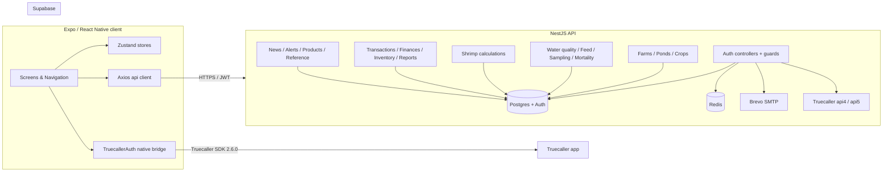

# Upcheck — Features & Technical Reference

A single source of truth for every product feature in Upcheck and the technical machinery that powers it. This file is generated from the live codebase (NestJS API in `backend/`, Expo / React Native client in `frontend/`, Supabase schema in `supabase_setup.sql`, and the spec artefacts under `.kiro/specs/`).

> **Domain.** Upcheck is a shrimp-farming operations platform built for the Indian aquaculture market. It supports multi-farm farm/pond/crop hierarchies, daily field logs, calculators, simulations, finance, an in-app eShop, and a multi-provider auth stack including Truecaller One-Tap.

---

## 0. Reconciliation notes (2026-06-01)

This document drifted from the implementation; the following corrections apply (see `AUDIT.md` for the full audit + remediation log). The body below is otherwise kept as the product reference.

- **Route shapes:** the chemical/plankton/microbiology controllers are mounted at `/api/chemical-data`, `/api/plankton-data`, `/api/microbiology-data`, and these (plus mortality) expose list-by-parent as `GET .../crop/:cropId` (not `?pondId=`). Disease library seeding is `POST /disease/library/seed` (was a side-effecting GET). Reference update routes are `PATCH` (were `PUT`).
- **Now implemented (previously advertised but absent):** TOTP **2FA** (`/auth/supabase/2fa/*` + Settings screen), passwordless **email OTP login** (`/auth/supabase/login-otp/*`), and **push notifications** end-to-end (`/push/register`, Expo delivery on auto-alerts, `users.push_token`).
- **Now wired (previously backend-only):** News, Products/eShop, Expenses, Transactions, Reference (with create), Harvest-plans, Feed-products, pond dimension data, and the Growth/Harvest/Biomass/Feeding-rate calculators all have reachable screens.
- **Database:** production schema is provisioned by a generated baseline migration (`1700000000000-BaselineSchema`) + `migrationsRun` in prod — not by dev-only `synchronize`.
- **Corrections to claims:** Google sign-in uses Supabase `signInWithIdToken` (the `google-auth-library` dependency is not used in app auth); the `tasks` module/board is fully implemented (it was omitted here); calculators DO call the API (not purely client-side); `i18next` is now actually initialised and used (was an unused dependency).
- **Known accepted exceptions (by design, not bugs):** `GET /profiles/me` lazily upserts a profile row (provisioning safety-net); the global `JwtAuthGuard` validates each request against Supabase; feed-products is a shared catalogue (no per-user ownership).

---

## 1. High-level product features

### 1.1 Authentication & identity
- **Email + password** sign-up and sign-in with Supabase Auth.
- **Email verification** via Brevo SMTP, with resend-verification flow.
- **Forgot password / reset password** through Supabase magic links.
- **Google OAuth** for Web, iOS, and Android client IDs (server-side ID-token verification with `google-auth-library`).
- **Truecaller One-Tap (Flow A)** using Truecaller Android SDK 2.6.0 via a native Java bridge. Verified server-side with RSA signature checking against cached Truecaller public keys, plus replay protection via a nonce store.
- **Truecaller OTP / missed-call fallback (Flow B)** for users without the Truecaller app, with server-to-server access-token verification against `api5.truecaller.com`.
- **Two-factor authentication (2FA)** TOTP-based via `otplib`, with QR enrolment using `qrcode`.
- **OTP login** (separate from 2FA) for passwordless sign-in via SMS code.
- **JWT session tokens** with access + refresh; refresh handled via Axios interceptors on the client.
- **SecureStore persistence** of refresh tokens on the device (`expo-secure-store`).
- **Account linking** so a phone number authenticated via Truecaller is matched to any existing email-based account on the same identity.
- **Sign-out** clears the cached Truecaller session so the next sign-in re-prompts consent.

### 1.2 Farm hierarchy
- **Farms** — top-level operational unit owned by a user.
- **Ponds** — belong to a farm; carry dimensions (history is tracked) and naming rules enforced by `pond-naming.service.ts`.
- **Crops / cycles** — culture cycles inside a pond (stocking → growth → harvest), with explicit harvest action.

### 1.3 Daily operational logs
Operational data captured per pond and per crop:
- **Water quality** (pH, DO, temperature, salinity, ammonia, nitrite, alkalinity, etc.).
- **Feed records** with totals per pond.
- **Feeding tray checks** to monitor feed consumption.
- **Sampling** for average body weight (ABW) tracking.
- **Mortality records.**
- **Chemical** treatments (probiotics, lime, etc.).
- **Plankton** counts.
- **Microbiology** results.
- **Disease** records linked to a disease library / encyclopedia.
- **Treatments** log linked to disease records.
- **Harvest records** for partial and full harvests.

### 1.4 Calculators (in-app, no backend round-trip required)
Backed by `ShrimpCalculationsService`:
- **Feed Conversion Ratio (FCR)** = total feed (kg) / harvest weight (kg).
- **Average Daily Growth (ADG)** = (final weight − initial weight) / days of culture.
- **Survival Rate (SR)** = harvested count / initial stock × 100.
- **Daily feed amount** = biomass × feeding rate %.
- **Expected harvest** (count + weight in kg).
- **Growth projection** from current weight and ADG, broken down by week.
- **Biomass** = stock count × average weight / 1000.
- **Recommended feeding rate** by shrimp size (10% under 3 g, sliding to 2.5% above 20 g).
- **Cultivation performance** — derives biomass, population, FCR, SR from feeding data.
- **Free / un-ionised ammonia** — from TAN, pH, and temperature using pKa = 0.09018 + 2729.92 / T(K), with toxicity bands (safe / warning / critical).
- **Product dosage** — kg of product = pond area (m²) × water depth (m) × ppm / 1000.

Frontend calculator screens: `CalculatorHubScreen`, `CultivationPerformanceScreen`, `DailyFeedCalculatorScreen`, `ProductAmountScreen`, `FreeAmmoniaScreen`.

### 1.5 Simulations & harvest planning
- **Simulations** — what-if scenarios (`simulations` module), with create, list, and results screens.
- **Harvest plans** — planned harvest schedules tied to crops.

### 1.6 Finance & inventory
- **Transactions** — income / expense tracking per farm, with farm-level summaries.
- **Finances / expenses** — separate expenses controller with its own DTOs.
- **Inventory** — stock per farm with category filters and a "low stock" endpoint.
- **Feed products** — catalogue of feed SKUs.

### 1.7 Health & disease
- **Disease library** — seeded reference data for shrimp diseases.
- **Disease records** — per-pond disease incidents.
- **Disease encyclopedia screens** in the client (list + detail).
- **Treatments** — treatments applied per disease record.

### 1.8 Content, alerts, and the eShop
- **News** — articles feed (filterable by category).
- **Alerts** — per-user notifications with unread count, mark-as-read, and bulk read endpoints.
- **Products / eShop** — products catalogue with stock-update endpoint.

### 1.9 Reports
- **Aggregations** under `/api/reports/*` — production, finance, and operational summaries.
- **Reports tab** in the client surfaces them as a top-level destination.

### 1.10 Reference data
Seedable reference tables under `backend/src/reference/`:
- **Species**, **Hatchery**, **Broodstock** entities with full CRUD.
- One-shot seed runner via `npm run seed:reference`.

### 1.11 Cross-cutting client features
- **Offline-first sync** scaffolding via WatermelonDB (`@nozbe/watermelondb`) on the client.
- **Push notifications** with `expo-notifications`, registered on app launch.
- **Internationalisation** with `i18next` + `react-i18next`.
- **Theming** with semantic color roles, gradients, radii, shadows, spacing, and typography tokens.
- **Charts** — bar and line charts (`react-native-chart-kit`).
- **Maps** — `react-native-maps` for farm geolocation.
- **Image capture** via `expo-image-picker`, **clipboard** via `expo-clipboard`, **haptics** via `expo-haptics`, **device info** via `expo-device`.
- **Error boundary** at the navigation root.
- **Global unhandled-promise-rejection handler** to keep Android production builds from crashing on stray rejections.

---

## 2. Repository layout

```
UPCHECKAPP/
├── backend/                NestJS 11 API (TypeORM, Supabase, Redis)
│   ├── src/                30 feature modules (auth, farms, ponds, …)
│   ├── package.json
│   ├── render.yaml         Render web + cron config
│   └── README.md           Backend docs (Truecaller verifier notes)
├── frontend/               Expo SDK 54 / React Native 0.81 app
│   ├── src/
│   │   ├── api/            Axios client + interceptors, per-resource clients
│   │   ├── components/     Shared UI (charts, forms, layout, ui/*)
│   │   ├── native/         TruecallerAuth bridge wrapper, permissions helper
│   │   ├── navigation/     RootNavigator + MainNavigator (tabs)
│   │   ├── screens/        auth, main, farms, ponds, cycles, logs, calculators, simulation, settings, …
│   │   ├── store/          Zustand stores
│   │   └── theme/          Design tokens
│   ├── android/            Android Gradle project (com.upcheck.app)
│   ├── app.config.ts
│   └── package.json
├── .kiro/specs/            Spec-driven development artefacts
│   └── truecaller-auth/    requirements.md, design.md, tasks.md, qa/
├── .github/workflows/      Android build pipelines
├── render.yaml             Render.com deploy manifest for the backend
├── supabase_setup.sql      One-shot DB bootstrap + trigger for Supabase
├── README-AUTH.md          Auth module + Truecaller console setup guide
└── TruecallerAuth.md       Source-of-truth implementation guide for SDK 2.6.0
```

---

## 3. Tech stack

| Layer | Choices |
| --- | --- |
| Mobile / web client | Expo SDK 54, React Native 0.81, React 19, React Navigation 7, Zustand 5, React Native Paper, i18next, WatermelonDB |
| Native bridges | Java native module for Truecaller SDK 2.6.0 (`com.upcheck.app.TruecallerAuthModule`); also `@dhana-cs/react-native-truecaller` Expo plugin used to wire the Android manifest |
| Backend | NestJS 11, Express, TypeORM 0.3, class-validator, `@nestjs/throttler`, `@nestjs/schedule` |
| Auth | Supabase Auth (Postgres-backed), JWT (`jsonwebtoken`), Google OAuth (`google-auth-library`), Truecaller One-Tap + OTP, TOTP (`otplib`), bcrypt + argon2 for password hashing, `zxcvbn` for password strength |
| Persistence | Supabase Postgres, Redis (`ioredis` via `@nestjs-modules/ioredis`), WatermelonDB on the client |
| Email | Brevo (`@getbrevo/brevo`) over SMTP relay (`nodemailer`) |
| HTTP | `axios` (both server and client) |
| Testing | Jest + ts-jest (backend), jest-expo + `@testing-library/react-native` (frontend), `fast-check` property-based tests on both surfaces, `nock` for HTTP fakes, `sqlite3` for in-memory tests |
| Build / deploy | Render.com web service + cron job (backend), EAS / Play Internal Testing (Android), GitHub Actions for Android builds |

---

## 4. Architecture



Key conventions:
- Single `/api` global prefix (`app.setGlobalPrefix('api')` in `backend/src/main.ts`).
- CORS configured from `CORS_ORIGIN` (defaults to `*`); credentials enabled when an explicit origin list is supplied.
- Global `ValidationPipe` with `whitelist: true`, `transform: true`.
- Global `TypeORMExceptionFilter` for consistent DB error responses.
- Two app-wide guards: `ThrottlerGuard` (60 req / 60 s default) and `JwtAuthGuard` (Supabase JWT-based, with `@Public()` decorator to opt out).

---

## 5. Backend (NestJS) — modules and entities

The root module wires the following feature modules (see `backend/src/app.module.ts`):

`ProfilesModule`, `FarmsModule`, `AuthModule`, `RedisModule`, `PondsModule`, `CropsModule`, `WaterQualityModule`, `FeedRecordsModule`, `ShrimpCalculationsModule`, `TransactionsModule`, `InventoryModule`, `NewsModule`, `AlertsModule`, `ProductsModule`, `SimulationsModule`, `HarvestPlansModule`, `ChemicalModule`, `PlanktonModule`, `MicrobiologyModule`, `MortalityModule`, `DiseaseModule`, `ReferenceModule`, `SamplingModule`, `TreatmentsModule`, `HarvestsModule`, `FeedProductsModule`, `FeedingTrayChecksModule`, `FinancesModule`, `ReportsModule`.

| Module | Entity files | Responsibility |
| --- | --- | --- |
| `auth/` | `user.entity.ts` | Email/password, Google OAuth, Truecaller verifier, JWT guards, 2FA, OTP, password reset |
| `profiles/` | `profile.entity.ts` | User profile CRUD on `public.users` |
| `farms/` | `farm.entity.ts` | Farm CRUD scoped to a user |
| `ponds/` | `pond.entity.ts`, `pond-dimension-history.entity.ts` | Ponds, dimension history, naming rules |
| `crops/` | `crop.entity.ts` | Crop / culture cycles |
| `water-quality/` | `water-quality-record.entity.ts` | Water-quality logs |
| `feed-records/` | `feed-record.entity.ts` | Feed logs |
| `feeding-tray-checks/` | `feeding-tray-check.entity.ts` | Feed-tray check logs |
| `sampling/` | `sampling-data.entity.ts` | ABW sampling |
| `mortality/` | `mortality-record.entity.ts` | Mortality logs |
| `chemical/` | `chemical-data.entity.ts` | Chemical applications |
| `plankton/` | `plankton-data.entity.ts` | Plankton counts |
| `microbiology/` | `microbiology-data.entity.ts` | Microbiology results |
| `disease/` | `disease-library.entity.ts`, `disease-record.entity.ts` | Disease encyclopedia + records |
| `treatments/` | `treatment.entity.ts` | Treatment logs |
| `harvests/` | `harvest.entity.ts`, `harvest-record.entity.ts` | Harvest events |
| `harvest-plans/` | `harvest-plan.entity.ts` | Planned harvest schedules |
| `simulations/` | `simulation.entity.ts` | What-if simulations |
| `shrimp-calculations/` | (none — pure service) | FCR, ADG, SR, biomass, projection, free ammonia, dosage |
| `transactions/` | `transaction.entity.ts` | Income / expense per farm |
| `finances/` | `expense.entity.ts` | Expense module |
| `inventory/` | `inventory-item.entity.ts` | Stock per farm + low-stock query |
| `feed-products/` | `feed-product.entity.ts` | Feed SKU catalogue |
| `news/` | `news-article.entity.ts` | News feed |
| `alerts/` | `alert.entity.ts` | User alerts |
| `products/` | `product.entity.ts` | eShop products |
| `reference/` | `species.entity.ts`, `hatchery.entity.ts`, `broodstock.entity.ts` | Reference / lookup data |
| `reports/` | (none — service) | Aggregations |
| `redis/` | (none — service) | Shared Redis client |

### 5.1 Common building blocks
- `common/dto/page-options.dto.ts`, `page.dto.ts` — pagination DTOs.
- `common/decorators/owns-resource.decorator.ts` — declarative per-resource ownership checks.
- `common/guards/ownership.guard.ts` — runtime ownership enforcement.
- `common/filters/typeorm-exception.filter.ts` — DB error normalisation.

### 5.2 Authentication module (`backend/src/auth/`)
- **Controllers**: `SupabaseAuthController` (`/auth/supabase/*`).
- **Services**: `SupabaseAuthService`, `TruecallerService`.
- **Guards**: `SupabaseAuthGuard`, `JwtAuthGuard`, `RolesGuard`, `PermissionsGuard`.
- **Decorators**: `@Public`, `@CurrentUser`, `@Roles`, `@Permissions`.
- **Roles enum** (`roles.enum.ts`) and **permissions enum** (`permissions.enum.ts`).
- **DTOs**: register, login, login-otp, login-2fa, send-otp, verify-otp, change-password, reset-password, forgot-password, resend-verification, enable-2fa, disable-2fa, delete-account, google-login, truecaller-auth.

The Truecaller route is locked down with two extra layers:
- A method-level `ValidationPipe` with a custom `exceptionFactory` that converts DTO failures into HTTP 401 with `{ success: false, message: 'Invalid request' }` (Requirement 13.4).
- A route-scoped `TruecallerInvalidRequestFilter` catches any `BadRequestException` raised before the method-level pipe runs (e.g. by the global pipe) and re-emits the same 401 envelope without leaking field values.

---

## 6. HTTP API (under `/api`)

### 6.1 Authentication (`/api/auth/supabase`)
| Method | Path | Purpose |
| --- | --- | --- |
| `POST` | `/auth/supabase/signup` | Email/password registration |
| `POST` | `/auth/supabase/signin` | Email/password sign-in |
| `POST` | `/auth/supabase/oauth/google` | Google ID-token exchange |
| `POST` | `/auth/supabase/oauth/truecaller` | Truecaller One-Tap or OTP flow exchange (HTTP 200 on success, 401 on any validation failure) |
| `POST` | `/auth/supabase/refresh` | Refresh-token exchange |
| `POST` | `/auth/supabase/signout` | Revoke current session (auth required) |
| `GET` | `/auth/supabase/me` | Current Supabase user (auth required) |
| `POST` | `/auth/supabase/update` | Update email / password / metadata (auth required) |
| `POST` | `/auth/supabase/forgot-password` | Send password-reset email |
| `POST` | `/auth/supabase/update-password` | Change password (auth required) |
| `POST` | `/auth/supabase/resend-verification` | Resend email-verification link |

### 6.2 Profiles
`POST /api/profiles`, `GET /api/profiles`, `GET /api/profiles/:id`, `PATCH /api/profiles/:id`.

### 6.3 Farms
`POST /api/farms`, `GET /api/farms?userId=`, `GET /api/farms/:id`, `PATCH /api/farms/:id`, `DELETE /api/farms/:id`.

### 6.4 Ponds
`POST /api/ponds`, `GET /api/ponds?farmId=`, `GET /api/ponds/:id`, `PATCH /api/ponds/:id`, `DELETE /api/ponds/:id`.

### 6.5 Crops
`POST /api/crops`, `GET /api/crops?pondId=`, `GET /api/crops/:id`, `PATCH /api/crops/:id`, `PATCH /api/crops/:id/harvest`, `DELETE /api/crops/:id`.

### 6.6 Operational logs
- **Water quality**: `POST /api/water-quality`, `GET /api/water-quality?pondId=`, `GET /api/water-quality/pond/:pondId/latest`, `GET /api/water-quality/:id`, `PATCH /api/water-quality/:id`, `DELETE /api/water-quality/:id`.
- **Feed records**: `POST /api/feed-records`, `GET /api/feed-records?pondId=`, `GET /api/feed-records/pond/:pondId/total`, `GET /api/feed-records/:id`, `PATCH /api/feed-records/:id`, `DELETE /api/feed-records/:id`.
- Sampling, mortality, chemical, plankton, microbiology, disease, treatments, harvests, harvest-plans, feeding-tray-checks each follow the same `POST / GET (filtered) / GET :id / PATCH / DELETE` shape under `/api/{module}`.

### 6.7 Calculations (`/api/shrimp-calculations`)
`POST .../fcr`, `POST .../adg`, `POST .../survival-rate`, `POST .../daily-feed`, `POST .../expected-harvest`, `POST .../growth-projection`, `GET .../biomass?stockCount=&averageWeightG=`, `GET .../recommended-feeding-rate?averageWeightG=`. Free-ammonia and product-dosage helpers are exposed by the same service, used both on the server and mirrored client-side.

### 6.8 Finance & inventory
- **Transactions**: `POST /api/transactions`, `GET /api/transactions?farmId=&type=`, `GET /api/transactions/farm/:farmId/summary`, `GET /api/transactions/:id`, `PATCH /api/transactions/:id`, `DELETE /api/transactions/:id`.
- **Inventory**: `POST /api/inventory`, `GET /api/inventory?farmId=&category=`, `GET /api/inventory/low-stock/:farmId`, `GET /api/inventory/:id`, `PATCH /api/inventory/:id`, `DELETE /api/inventory/:id`.
- **Feed products**, **expenses** follow the same per-resource pattern.

### 6.9 News, alerts, products
- **News**: `POST /api/news`, `GET /api/news?category=`, `GET /api/news/:id`, `PATCH /api/news/:id`, `DELETE /api/news/:id`.
- **Alerts**: `POST /api/alerts`, `GET /api/alerts/user/:userId?unreadOnly=`, `GET /api/alerts/user/:userId/count`, `PATCH /api/alerts/:id/read`, `PATCH /api/alerts/user/:userId/read-all`, `DELETE /api/alerts/:id`.
- **Products**: `POST /api/products`, `GET /api/products?category=`, `GET /api/products/:id`, `PATCH /api/products/:id`, `PATCH /api/products/:id/stock`, `DELETE /api/products/:id`.

### 6.10 Reports & reference
- **Reports** under `/api/reports/*` — production / finance aggregations.
- **Reference** under `/api/reference/*` — species, hatchery, broodstock CRUD.

### 6.11 Health
`GET /api/auth/health` — used by the Render `healthCheckPath`.

---

## 7. Database (Supabase / Postgres)

- TypeORM `autoLoadEntities: true`. `synchronize` is enabled in dev, disabled in production.
- Production uses `DATABASE_URL` with `ssl: { rejectUnauthorized: false }`.
- Test runs can swap to SQLite in-memory by setting `DB_TYPE=sqlite`.
- Migrations live in `backend/src/migrations/` (`InitialSchema`, `DatabaseQualityFixes`, `SeedDiseaseLibrary`).

### 7.1 `public.users` mirror trigger
`supabase_setup.sql` installs:
- `public.handle_new_user()` (`SECURITY DEFINER`) — derives `username`, `firstName`, `lastName`, `auth_provider`, `email_verified`, `google_id`, and `avatar_url` from Supabase auth metadata, then upserts into `public.users`. Includes a username-collision loop that suffixes `1, 2, 3, …` until unique.
- Two triggers, `on_auth_user_created` (AFTER INSERT) and `on_auth_user_updated` (AFTER UPDATE), both on `auth.users`.
- A backfill that copies any existing `auth.users` rows into `public.users` once.
- Verification queries that count both tables and list the trigger names.

This trigger covers email/password, Google OAuth, and Truecaller flows uniformly.

---

## 8. Authentication architecture

### 8.1 Supabase auth service
`SupabaseAuthService` exposes:
- `signUp(email, password, { firstName, lastName, username })`
- `signIn(email, password)`
- `signInWithIdToken('google', idToken)`
- `signInWithTruecaller({ phoneNumber, firstName, lastName, email, avatarUrl })` — only ever called with values sourced from a verified Truecaller profile (Requirement 11.1).
- `refreshSession(refreshToken)`
- `signOut(token)`
- `updateUser`, `updatePassword`, `sendPasswordResetEmail`, `sendVerificationEmail`.

Account-linking logic in `SupabaseAuthService.signInWithTruecaller` is covered by `supabase-auth.service.linking.property.spec.ts` (fast-check property tests for branch correctness and idempotence).

### 8.2 Truecaller verification service
`TruecallerService` (`backend/src/auth/truecaller.service.ts`) verifies the two flows produced by Truecaller Android SDK 2.6.0:

**Flow A — One-Tap (signed payload).**
Client posts `{ payload, signature, signatureAlgorithm, requestNonce, phoneNumber, firstName, lastName }`.
Server:
1. Fetches Truecaller RSA public keys from `TRUECALLER_KEYS_API_URL` (default `https://api4.truecaller.com/v1/key`), with an in-memory cache + singleflight refresh.
2. Verifies the RSA signature over the base64 payload.
3. Decodes the payload and validates the embedded `requestNonce` and `requestTime` against the request and the configured TTL.
4. Records the nonce in an in-memory replay store (`SET NX EX` semantics) so a replay is rejected.

**Flow B — OTP / missed-call (access token).**
Client posts `{ accessToken, phoneNumber, firstName, lastName }`. Server issues a server-to-server `GET` to `TRUECALLER_PROFILE_API_URL` (default `https://api5.truecaller.com/v1/otp/installation/verify/profile`) with a Bearer token, and cross-checks the returned `phoneNumber` against the request after stripping `+91` / `91` and non-digits.

**Error contract** (Requirements 9 and 10):
- `Invalid signature`, `Invalid payload`, `Nonce mismatch`, `Payload expired`, `Nonce already used` for Flow A.
- `Invalid access token`, `Invalid Truecaller profile`, `Phone number mismatch` for Flow B.
- All malformed-body cases collapse to HTTP 401 with `{ success: false, message: 'Invalid request' }` (Requirement 13.4).

**Property-based test suites:**
- `truecaller.service.signature.property.spec.ts` — mutated payload / signature / nonce / timestamp.
- `truecaller.service.nonce.property.spec.ts` — replay-store invariants under random op sequences.
- `truecaller.service.phone.property.spec.ts` — phone normalisation invariants.
- `truecaller.service.integration.spec.ts` — wired through to the controller via `nock`.

### 8.3 Logging hygiene
Sensitive fields (`payload`, `signature`, `requestNonce`, `accessToken`, full `phoneNumber`) are scrubbed from production logs. Phone numbers in diagnostic logs are masked to the last four digits (`+91XXXXXX1234`) per Requirement 13.3.

### 8.4 Replay-store and key-cache caveats
The in-memory nonce replay store and public-key cache are single-process. Multi-replica deployments need a shared store (Redis `SET NX EX`) before they can guarantee replay rejection across nodes.

---

## 9. Truecaller Android integration (client side)

- **SDK**: `com.truecaller.android.sdk:truecaller-sdk:2.6.0` (legacy v2.x, Partner-Key based, **not** the OAuth 3.0 SDK).
- **Native bridge**: `com.upcheck.app.TruecallerAuthModule` plus a corresponding `TruecallerAuthPackage`. The full reference implementation lives in `TruecallerAuth.md`.
- **JS wrapper**: `frontend/src/native/TruecallerAuth.ts` exposes `isUsable()`, `authenticate()`, `startManualVerification(phoneNumber, firstName, lastName)`, `verifyOtp(otp, firstName, lastName)`, and `clear()`.
- **Permissions helper**: `frontend/src/native/truecallerPermissions.ts` requests the runtime subset of `READ_PHONE_STATE`, `READ_CALL_LOG`, `ANSWER_PHONE_CALLS` (API 26+) or `CALL_PHONE` (≤25). Denials are surfaced in `TruecallerLoginScreen` so the SDK is never called without consent.
- **Hook**: `frontend/src/hooks/useTruecallerAuth.ts` wraps the bridge for screen consumption.
- **UI**: `TruecallerLoginButton`, `PhoneVerificationModal`, and the dedicated `TruecallerLoginScreen` (covered by `TruecallerLoginScreen.*.test.tsx` property tests for the phase machine and email-link reachability).
- **Manifest config**: declares `INTERNET`, `READ_PHONE_STATE`, `READ_CALL_LOG`, `CALL_PHONE`, `ANSWER_PHONE_CALLS` (gated to `minSdkVersion=26`), `RECEIVE_SMS`, plus `meta-data android:name="com.truecaller.android.sdk.PartnerKey"`.
- **Partner key storage**: `frontend/android/app/src/main/res/values/partner-keys.xml` (gitignored). Non-secret string resources (app name, splash, runtime version) stay in the tracked `strings.xml`.
- **Expo plugin**: `@dhana-cs/react-native-truecaller`'s `withTruecaller` plugin in `app.config.ts` propagates the `clientId` (Truecaller Android client ID) at prebuild.

### 9.1 Console + signing prerequisites
Documented in `README-AUTH.md` and `TruecallerAuth.md`:
- App registered on https://developer.truecaller.com with package name `com.upcheck.app`.
- Both **debug** and **release** SHA-1s registered, plus Play App Signing SHA-1 if Play App Signing is enabled.
- At least three test phone numbers registered (Requirement 1.4).
- 11-character SMS Retriever hash registered for each signing key when SMS auto-OTP is enabled (Requirement 1.5).

---

## 10. Frontend (Expo / React Native)

### 10.1 Entry points
- `frontend/index.ts` registers `App.tsx`.
- `App.tsx` loads Nunito / DM Sans / DM Mono fonts, sets up `expo-notifications`, installs an unhandled-promise-rejection tracker, then renders `ErrorBoundary → SafeAreaProvider → NavigationContainer → RootNavigator`.

### 10.2 Navigation
- `RootNavigator` (`createNativeStackNavigator`) splits on `useAuthStore.isAuthenticated`:
  - **Unauthenticated stack**: `Login`, `Register`, `ForgotPassword`, `TruecallerLogin`.
  - **Authenticated stack**: `MainApp` (the bottom tabs) plus screens for farms, ponds, cycles, log entry (water-quality, feed, sampling, treatment, harvest, mortality, chemical, plankton, microbiology, disease), calculators (hub + four calculators), simulations (list / create / results), per-log history screens, settings (profile, settings, notifications, help, about), inventory (list + detail), and the disease encyclopedia (list + detail).
- `MainNavigator` (`createBottomTabNavigator`) provides four tabs: `Dashboard`, `Farms`, `Reports`, `More`.

### 10.3 State management
- **Zustand stores** in `frontend/src/store/`:
  - `authStore` — session, user, status (`initializing`, `unauthenticated`, `awaiting_verification`, `authenticated`, `refreshing`), pending-verification email, error, and actions (`login`, `googleLogin`, `truecallerLogin`, `signup`, `logout`, `forgotPassword`, `initialize`). Persisted to `expo-secure-store`, but only the **refresh token**, `userId`, `userEmail`, and pending-verification email — never the full session — to stay under SecureStore's 2 KB limit.
  - `activeFarmStore` — currently selected farm.
  - `calculatorStore` — sticky calculator inputs.
  - `notificationStore` — alert state.
  - `syncStore` — offline-first sync state.
  - `uiStore` — UI flags (modals, banners).
  - `uploadStore` — image-upload progress.

### 10.4 API layer
`frontend/src/api/` contains an Axios client (`client.ts`) with auth interceptors and per-resource clients: `auth`, `profiles`, `farms`, `ponds`, `crops`, `waterQuality`, `feedRecords`, `feedingTrayChecks`, `feedProducts`, `sampling`, `mortalities`, `inventory`, `transactions` (+ `expenses`), `harvests`, `harvestPlans`, `simulations`, `news`, `alerts`, `products`, `reports`, `reference`, `treatments`, `diseases`, `calculators`, `logResources`.

### 10.5 Components
`frontend/src/components/`:
- `charts/` — `BarChart`, `LineChart` (built on `react-native-chart-kit`).
- `forms/` — `ParameterInput` for typed water-quality / feed inputs.
- `layout/` — `ScreenWrapper` for consistent screen padding + safe-area handling.
- `ui/` — `Button`, `Card`, `MetricCard`, `Input`, `StatusBadge`, `EmptyState`, `ErrorState`, `Skeleton`, `AlertBanner`, `OfflineIndicator`, `FAB`, `GoogleLoginButton`, `TruecallerLoginButton`, `PhoneVerificationModal`.
- `ErrorBoundary.tsx` — top-level error boundary.

### 10.6 Theming
`frontend/src/theme/`:
- `colors.ts`, `colorRoles.ts` (semantic light/dark roles).
- `gradients.ts`, `radius.ts`, `shadows.ts`, `spacing.ts`, `typography.ts`, `tokens.ts` (component-level tokens such as the tab bar), `index.ts` (single exported `theme`).

### 10.7 Notifications
`frontend/src/utils/notifications.ts` exposes `registerForPushNotificationsAsync` which is invoked from `App.tsx` to obtain an Expo push token and wire `addNotificationReceivedListener` / `addNotificationResponseReceivedListener`.

### 10.8 Offline-first sync
The client lists `@nozbe/watermelondb` and `expo-sqlite` as dependencies and ships a `syncStore`; full schema and reactive queries are implementation-in-progress (the WatermelonDB doctor check is explicitly excluded in `package.json`).

---

## 11. Environment variables

### 11.1 Backend (`backend/.env`)
| Variable | Purpose |
| --- | --- |
| `PORT` | HTTP port (default `8080`; Render uses `10000`) |
| `NODE_ENV` | Toggles TypeORM `synchronize` and SSL behaviour |
| `DB_TYPE` | `postgres` (default) or `sqlite` for tests |
| `DB_NAME` | SQLite database file (or `:memory:`) when `DB_TYPE=sqlite` |
| `DATABASE_URL` | Postgres connection string |
| `CORS_ORIGIN` | Comma-separated allow-list, or `*` |
| `SUPABASE_URL` / `SUPABASE_ANON_KEY` / `SUPABASE_SERVICE_ROLE_KEY` / `SUPABASE_JWT_SECRET` | Supabase project credentials |
| `JWT_SECRET` | App-issued token signing secret |
| `SMTP_HOST` / `SMTP_PORT` / `SMTP_SECURE` / `SMTP_USER` / `SMTP_PASS` / `SMTP_SENDER_NAME` / `SMTP_SENDER_EMAIL` | Brevo transactional email |
| `GOOGLE_CLIENT_ID` / `GOOGLE_CLIENT_SECRET` | Google OAuth |
| `FRONTEND_URL` | Used in email links |
| `TRUECALLER_PUBLIC_KEY_TTL_SECONDS` | Public-key cache TTL, clamped to `[3600, 86400]` |
| `TRUECALLER_NONCE_TTL_SECONDS` | Replay-store TTL, floor `600` |
| `TRUECALLER_PROFILE_API_URL` | Override for `https://api5.truecaller.com/v1/otp/installation/verify/profile` |
| `TRUECALLER_KEYS_API_URL` | Override for `https://api4.truecaller.com/v1/key` |

### 11.2 Frontend (`EXPO_PUBLIC_*`, read in `app.config.ts`)
| Variable | Purpose |
| --- | --- |
| `EXPO_PUBLIC_API_BASE_URL` | Backend base URL including the `/api` prefix |
| `EXPO_PUBLIC_SUPABASE_URL` / `EXPO_PUBLIC_SUPABASE_ANON_KEY` | Supabase client config |
| `EXPO_PUBLIC_GOOGLE_CLIENT_ID_WEB` / `_IOS` / `_ANDROID` | Google sign-in client IDs per platform |
| `EXPO_PUBLIC_TRUECALLER_ANDROID_CLIENT_ID` | Override for the Truecaller Android client ID used by the Expo plugin |
| `EXPO_PUBLIC_TRUECALLER_IOS_APP_KEY` / `EXPO_PUBLIC_TRUECALLER_IOS_APP_LINK` | Truecaller iOS bridge config (when an iOS bridge ships) |

The Android Truecaller `partnerKey` itself lives in `frontend/android/app/src/main/res/values/partner-keys.xml`, which is gitignored. Supply it via your secret store before building a release APK.

---

## 12. Testing

Backend (Jest + ts-jest + fast-check + nock):

```bash
cd backend && npm test
```

Frontend (jest-expo + `@testing-library/react-native` + fast-check):

```bash
cd frontend && npx jest
```

Notable property-based suites:
- `backend/src/auth/truecaller.service.signature.property.spec.ts` — signature verification under mutated payloads, signatures, nonces, and timestamps.
- `backend/src/auth/truecaller.service.nonce.property.spec.ts` — replay-store invariants.
- `backend/src/auth/truecaller.service.phone.property.spec.ts` — phone-number normalisation invariants.
- `backend/src/auth/supabase-auth.service.linking.property.spec.ts` — account-linking branch correctness and idempotence.
- `backend/src/auth/truecaller.service.integration.spec.ts` — controller wired up to an `nock`-backed Truecaller API.
- `frontend/src/screens/auth/__tests__/TruecallerLoginScreen.*.test.tsx` — phase-machine, dispatch, and email-link reachability properties.
- `frontend/src/native/__tests__/TruecallerAuth.bridge.property.test.ts` — native-bridge wrapper properties.

`frontend/jest.config.js` sets `testTimeout: 20000` so the full property suite runs under the default invocation.

Backend Jest config (in `backend/package.json`) anchors `rootDir` at `src/` with `testRegex: '.*\\.spec\\.ts$'`, runs in `node`, and reports coverage into `../coverage`.

---

## 13. Deployment

### 13.1 Backend (Render.com)
`render.yaml` provisions:
- A **web service** `upcheck-backend` (free plan, `rootDir: backend`) running `npm ci && npm run build` then `npm run start:prod`. Health check is `/api/auth/health`. Secrets (`SUPABASE_*`, `SMTP_USER`, `SMTP_PASS`, etc.) are bound via Render env-var sync. `PORT` is fixed to `10000`.
- An **hourly cron job** `otp-cleanup` (`schedule: "0 * * * *"`) that runs `npm run otp-cleanup`.

### 13.2 Android
GitHub Actions workflows under `.github/workflows/`:
- `android-build.yml` — full Android build pipeline.
- `android-build-fast.yaml` — faster iteration build.
- `android-build-auto.yaml` — auto-trigger build.

For a Truecaller-validated release, `keytool -list` SHA-1s for both the upload key and Play App Signing must be registered on the Truecaller console before the release APK will pass One-Tap. The release runbook lives at `.kiro/specs/truecaller-auth/qa/gate-e-release-build.md`.

EAS configuration is in `frontend/eas.json` with `runtimeVersion: "1.0.0"` and an `expo-updates` URL pointing at the registered project (`projectId: f3274022-ae8a-4be6-9085-23f935542a4c`).

---

## 14. Spec-driven development

Every significant feature is delivered through a spec under `.kiro/specs/<feature>/` with three artefacts:
- `requirements.md` — EARS-format acceptance criteria (numbered `Requirement N.M` for traceability).
- `design.md` — architecture, sequence diagrams, correctness properties.
- `tasks.md` — implementation plan with a wave-based dependency graph.
- `qa/` — runbooks for manual gates (e.g. `gate-e-release-build.md`).

The completed `truecaller-auth` spec is the working reference and drives the Truecaller code in both `backend/src/auth/` and `frontend/src/screens/auth/`.

---

## 15. Security notes

- Sensitive Truecaller fields (`payload`, `signature`, `requestNonce`, `accessToken`, full `phoneNumber`) are scrubbed from production logs; phone numbers in diagnostic logs are masked to the last four digits.
- The Truecaller `partnerKey`, Supabase service-role key, JWT secret, SMTP credentials, and Google client secret are all secrets — never commit them. `.gitignore` excludes `frontend/android/app/src/main/res/values/strings.xml`, `*.keystore`, `.env`, and `.env.*`.
- The in-memory nonce replay store and public-key cache are single-process. Production multi-replica deployments need a shared store (Redis `SET NX EX`) before they can guarantee replay rejection across nodes.
- Server-side signature verification on Truecaller payloads is non-optional; the client-side response alone must never be trusted.
- HTTP 401 with `{ success: false, message: 'Invalid request' }` is the only response shape allowed for malformed Truecaller bodies — field values must never echo back.
- `ValidationPipe` runs with `whitelist: true` so DTOs strip unknown fields before they reach services.
- Rate limiting is enabled globally via `@nestjs/throttler` (60 req / 60 s).
- SecureStore is used on the device, and only the refresh token + minimal user identifiers are persisted to stay under the 2 KB limit.

---

## 16. License

UNLICENSED — internal Upcheck project. Treat all source as proprietary unless and until a license is added.
