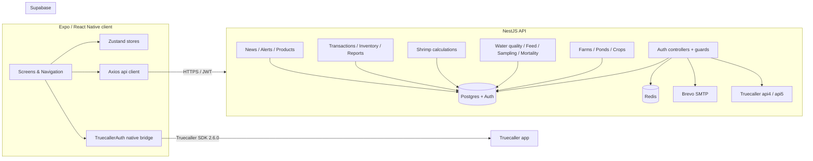

# Upcheck

Upcheck is a shrimp-farming operations app for the Indian aquaculture market. The repo is a monorepo with three top-level surfaces:

- `backend/` — NestJS API backed by Supabase (Postgres + Auth) and Redis
- `frontend/` — Expo / React Native app for Android, iOS, and web
- `.kiro/specs/` — formal specifications driving feature work (currently `truecaller-auth`)

The product covers farm and pond management, water-quality and feed records, shrimp growth calculations (FCR, ADG, survival rate, biomass), inventory, transactions, alerts, news, and an in-app eShop, with an authentication stack that supports email/password, Google OAuth, and Truecaller One-Tap + OTP fallback.

## Repository layout

```
UPCHECKAPP/
├── backend/                NestJS 11 API (TypeORM, Supabase, Redis)
│   ├── src/                14 feature modules (auth, farms, ponds, …)
│   ├── package.json
│   └── README.md           Backend-specific docs and Truecaller verifier notes
├── frontend/               Expo SDK 54 / React Native 0.81 app
│   ├── src/
│   │   ├── api/            Axios client, interceptors
│   │   ├── components/     Shared UI
│   │   ├── native/         TruecallerAuth bridge wrapper, permissions helper
│   │   ├── navigation/     React Navigation stacks/tabs
│   │   ├── screens/        Auth, farms, ponds, calculators, simulation, …
│   │   ├── store/          Zustand stores
│   │   └── theme/          Design tokens
│   ├── android/            Android Gradle project (com.upcheck.app)
│   ├── app.config.ts
│   └── package.json
├── .kiro/specs/            Spec-driven development artifacts
│   └── truecaller-auth/    requirements.md, design.md, tasks.md, qa/
├── .github/workflows/      Android build pipelines
├── render.yaml             Render.com deploy manifest for the backend
├── supabase_setup.sql      One-shot DB bootstrap for Supabase
├── README-AUTH.md          Auth module + Truecaller console setup guide
└── TruecallerAuth.md       Source-of-truth implementation guide for the SDK
```

## Tech stack

| Layer | Choices |
| --- | --- |
| Mobile / web client | Expo SDK 54, React Native 0.81, React 19, React Navigation 7, Zustand, React Native Paper, i18next |
| Native bridges | Java native module for Truecaller SDK 2.6.0 (`com.upcheck.app.TruecallerAuthModule`) |
| Backend | NestJS 11, Express, TypeORM 0.3, class-validator, Throttler, Schedule |
| Auth | Supabase Auth (Postgres-backed), JWT, Google OAuth, Truecaller One-Tap + OTP |
| Persistence | Supabase Postgres, Redis (rate limits + caches), WatermelonDB on the client for offline-first sync |
| Email | Brevo (SMTP relay) |
| Testing | Jest + ts-jest (backend), jest-expo + @testing-library/react-native (frontend), fast-check property-based tests on both surfaces, nock for HTTP fakes |
| Deploy | Render.com web service + cron job (backend), EAS / Play Internal Testing (Android) |

## Getting started

### Prerequisites

- Node.js 18+ and npm 9+
- JDK 17, Android SDK + platform-tools (for Android builds)
- A Supabase project (URL, anon key, service-role key, JWT secret)
- A Brevo account for transactional email (SMTP credentials)
- Optional: Google OAuth client IDs, Truecaller Partner Key for the One-Tap flow

### 1. Bootstrap the database

Open the Supabase SQL editor and run `supabase_setup.sql`. It installs the `handle_new_user` trigger that mirrors `auth.users` rows into `public.users` for email/password, Google OAuth, and Truecaller flows.

### 2. Backend

```bash
cd backend
cp .env.example .env          # then fill in real values
npm install
npm run start:dev             # http://localhost:8080
```

Useful scripts:

```bash
npm run build                 # compile to dist/
npm run start:prod            # node dist/main
npm test                      # Jest
npm run lint
npm run migration:run         # TypeORM migrations
```

Health check is exposed at `GET /api/auth/health` (used by the Render `healthCheckPath`).

### 3. Frontend (Expo)

```bash
cd frontend
npm install
npx expo start                # Metro bundler
npx expo run:android          # Build + install debug APK on a connected device
npx expo run:ios              # macOS only
```

Key Expo extras (read in `app.config.ts`) come from `EXPO_PUBLIC_*` env vars; defaults point at the live Render backend and a Supabase project so the app is runnable without local config for read-only flows. Override them when developing against a local backend:

```bash
export EXPO_PUBLIC_API_BASE_URL="http://192.168.1.10:8080/api"
export EXPO_PUBLIC_SUPABASE_URL="https://<your-project>.supabase.co"
export EXPO_PUBLIC_SUPABASE_ANON_KEY="<anon-key>"
```

## Environment variables

### Backend (`backend/.env`)

| Variable | Purpose |
| --- | --- |
| `PORT` | HTTP port (default `8080`; Render uses `10000`) |
| `DATABASE_URL` | Postgres connection string |
| `SUPABASE_URL` / `SUPABASE_ANON_KEY` / `SUPABASE_SERVICE_ROLE_KEY` / `SUPABASE_JWT_SECRET` | Supabase project credentials |
| `JWT_SECRET` | App-issued token signing secret |
| `SMTP_HOST` / `SMTP_PORT` / `SMTP_USER` / `SMTP_PASS` / `SMTP_SENDER_NAME` / `SMTP_SENDER_EMAIL` | Brevo transactional email |
| `GOOGLE_CLIENT_ID` / `GOOGLE_CLIENT_SECRET` | Google OAuth |
| `FRONTEND_URL` | Used in email links |
| `TRUECALLER_PUBLIC_KEY_TTL_SECONDS` | Public-key cache TTL, clamped to `[3600, 86400]` |
| `TRUECALLER_NONCE_TTL_SECONDS` | Replay-store TTL, floor `600` |
| `TRUECALLER_PROFILE_API_URL` | Override for `https://api5.truecaller.com/.../verify/profile` |
| `TRUECALLER_KEYS_API_URL` | Override for `https://api4.truecaller.com/v1/key` |

Full Truecaller verifier notes are in [`backend/README.md`](./backend/README.md#-truecaller-verification).

### Frontend (`EXPO_PUBLIC_*` env vars)

| Variable | Purpose |
| --- | --- |
| `EXPO_PUBLIC_API_BASE_URL` | Backend base URL including the `/api` prefix |
| `EXPO_PUBLIC_SUPABASE_URL` / `EXPO_PUBLIC_SUPABASE_ANON_KEY` | Supabase client config |
| `EXPO_PUBLIC_GOOGLE_CLIENT_ID_WEB/IOS/ANDROID` | Google sign-in client IDs per platform |
| `EXPO_PUBLIC_TRUECALLER_ANDROID_CLIENT_ID` | Optional override for the Truecaller console client ID |
| `EXPO_PUBLIC_TRUECALLER_IOS_APP_KEY` / `EXPO_PUBLIC_TRUECALLER_IOS_APP_LINK` | iOS Truecaller bridge config |

The Android Truecaller `partnerKey` lives in `frontend/android/app/src/main/res/values/strings.xml`, which is git-ignored. Supply it via your secret store before building a release APK; see [`README-AUTH.md`](./README-AUTH.md#truecaller-setup).

## Architecture



The backend exposes a single `/api` prefix and uses Supabase as the system of record for users, farms, ponds, crops, finance, and reference data. Redis backs rate limiters and the Truecaller public-key + nonce caches in development; production should swap the in-memory caches for Redis-backed implementations before scaling out replicas.

## Authentication

Three sign-in paths share the same Supabase session shape and the same `users` row schema:

- **Email + password** with optional 2FA, OTP, password reset, and email verification (`backend/src/auth/`, `frontend/src/screens/auth/`).
- **Google OAuth** via `@google-auth/library` server-side and `expo-auth-session` client-side.
- **Truecaller** with two flows behind a single SDK init (`SDK_OPTION_WITH_OTP`):
  - One-Tap (signed payload) for users with Truecaller installed.
  - OTP / missed-call fallback for non-Truecaller users.
  Server-side signature verification, replay protection, and account linking live in `backend/src/auth/truecaller.service.ts` and `supabase-auth.service.ts`. End-to-end design and QA gates are documented under `.kiro/specs/truecaller-auth/`.

Setup checklists for the Truecaller developer console, Android signing fingerprints, and SMS Retriever hash are in [`README-AUTH.md`](./README-AUTH.md#truecaller-setup).

## Backend modules

| Module | Responsibility |
| --- | --- |
| `auth/` | Email/password, Google OAuth, Truecaller verifier, JWT guards, 2FA, OTP, password reset |
| `profiles/` | User profile CRUD on the public.users table |
| `farms/`, `ponds/`, `crops/` | Multi-level farm hierarchy and crop cycles |
| `water-quality/`, `feed-records/`, `sampling/`, `mortality/`, `feeding-tray-checks/` | Operational logs |
| `shrimp-calculations/` | FCR, ADG, survival rate, biomass, expected harvest, growth projection |
| `transactions/`, `finances/`, `inventory/`, `feed-products/`, `chemical/` | Finance and stock |
| `harvests/`, `harvest-plans/`, `simulations/` | Cycle planning and what-if simulation |
| `disease/`, `microbiology/`, `plankton/`, `treatments/` | Health and treatment workflows |
| `news/`, `alerts/`, `products/` | Content, notifications, and the in-app eShop |
| `reports/`, `reference/` | Aggregations and seed reference data |

A full list of HTTP endpoints is in [`backend/README.md`](./backend/README.md#-api-endpoints).

## Testing

Run from the repo root:

```bash
# Backend unit + integration + property tests
cd backend && npm test

# Frontend property + integration tests (jest-expo)
cd frontend && npx jest
```

Notable test surfaces:

- `backend/src/auth/truecaller.service.signature.property.spec.ts` — fast-check signature verification with mutated payloads, signatures, nonces, and timestamps.
- `backend/src/auth/truecaller.service.nonce.property.spec.ts` — replay store invariants under random op sequences.
- `backend/src/auth/supabase-auth.service.linking.property.spec.ts` — account linking branch correctness and idempotence.
- `frontend/src/screens/auth/__tests__/TruecallerLoginScreen.*.test.tsx` — phase machine, dispatch, and email-link reachability properties for the login screen.

The frontend Jest config (`frontend/jest.config.js`) sets `testTimeout: 20000` so the full property suite runs under the default invocation.

## Deployment

- **Backend**: `render.yaml` provisions a Render web service plus an hourly OTP-cleanup cron job. The web service runs `npm ci && npm run build` and starts `npm run start:prod`. Secrets (`SUPABASE_*`, `SMTP_*`, etc.) are bound via Render env-var sync.
- **Android**: Workflows in `.github/workflows/` produce debug and release builds. For Truecaller release validation, follow `.kiro/specs/truecaller-auth/qa/gate-e-release-build.md` — release SHA-1 and Play App Signing SHA-1 must be registered on the Truecaller console before the release APK will pass One-Tap.

## Spec-driven development

Feature work uses formal specs under `.kiro/specs/<feature>/` with three artifacts:

- `requirements.md` — EARS-format acceptance criteria
- `design.md` — architecture, sequence diagrams, correctness properties
- `tasks.md` — implementation plan with a wave-based dependency graph

The completed `truecaller-auth` spec is the working reference. Each spec ships its own `qa/` folder with manual QA runbooks where end-to-end verification needs human or hardware involvement.

## Documentation

| Document | Topic |
| --- | --- |
| [`backend/README.md`](./backend/README.md) | Backend modules, endpoints, env vars, Truecaller verifier |
| [`README-AUTH.md`](./README-AUTH.md) | Auth flows and Truecaller console setup |
| [`TruecallerAuth.md`](./TruecallerAuth.md) | Source-of-truth implementation guide for SDK 2.6.0 |
| [`.kiro/specs/truecaller-auth/`](./.kiro/specs/truecaller-auth/) | Requirements, design, tasks, and QA runbooks for Truecaller auth |
| [`supabase_setup.sql`](./supabase_setup.sql) | One-shot Supabase schema and trigger bootstrap |
| [`render.yaml`](./render.yaml) | Render deploy manifest |

## Security notes

- Sensitive Truecaller fields (`payload`, `signature`, `requestNonce`, `accessToken`, full `phoneNumber`) are scrubbed from production logs. Phone numbers in diagnostic logs are masked to the last four digits.
- The Truecaller `partnerKey`, Supabase service-role key, JWT secret, SMTP credentials, and Google client secret are all secrets — never commit them. The `.gitignore` excludes `frontend/android/app/src/main/res/values/strings.xml`, `*.keystore`, `.env`, and `.env.*`.
- The in-memory nonce replay store and public-key cache are single-instance only. Production multi-replica deployments need a shared store (Redis `SET NX EX` works) before they can guarantee replay rejection across nodes.

## License

UNLICENSED — internal Upcheck project. Treat all source as proprietary unless and until a license is added.
